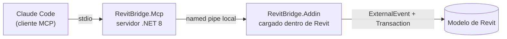
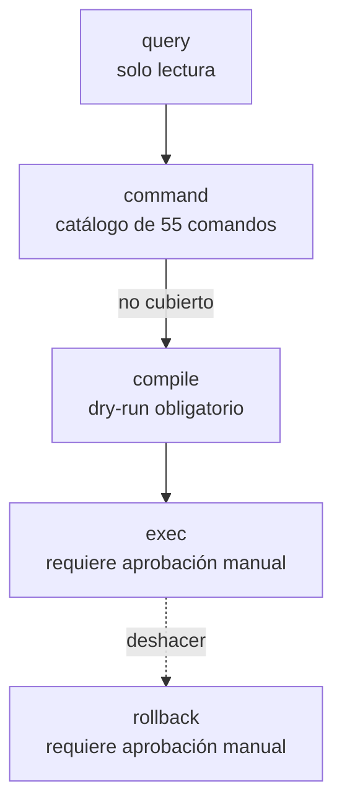
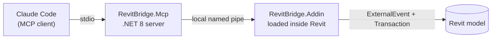
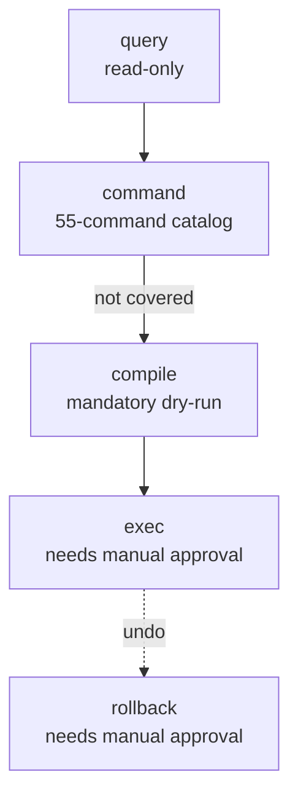

# RevitBridge

**Un agente de IA modelando dentro de Revit, con permiso siempre pedido antes de tocar nada que no haya creado él mismo.**
**An AI agent modeling inside Revit — that always asks before touching anything it didn't create itself.**

[🇪🇸 Español](#español) · [🇬🇧 English](#english)

---

## Español

### Qué es

RevitBridge conecta [Claude Code](https://claude.com/claude-code) directamente con una sesión abierta de Revit 2026. En vez de modelar clic a clic, describes lo que quieres — "crea seis muros con estas medidas", "pon una tabla con todas las puertas del proyecto", "duplica esta vista y cámbiale la escala" — y el agente lo hace dentro de tu modelo, en vivo.

No es una demo. Es un puente de dos procesos con 18 salvaguardas explícitas, pensado por un arquitecto que sabe exactamente qué significa dejar que algo automatizado toque un modelo real de cliente.

### Por qué existe

Ya hay varios "bridges IA-Revit" en circulación. La mayoría resuelven la parte fácil (conectar un LLM a la API) y no la difícil: **qué pasa cuando el LLM se equivoca dentro de tu modelo**. RevitBridge está diseñado al revés — primero las salvaguardas, después la capacidad:

- **Aprobación humana obligatoria** antes de borrar o modificar cualquier elemento que no se haya creado en la sesión actual.
- **Aprobación por creación masiva**, calibrable solo por variable de entorno — nunca por un parámetro que el propio modelo pueda subir para saltarse su propio límite.
- **Sin superficie de red**: canal local exclusivamente (named pipe con ACL del usuario actual). Sin puerto, sin token, sin nada que exponer.
- **El puente nunca escribe en disco** por su cuenta — ni `Save`, ni `SaveAs`, ni exportaciones. El usuario guarda, siempre.
- **Deshacer por sesión**: todo lo creado en la conversación actual se puede revertir con una previsualización antes de confirmar.
- **Filtrado de código antes de ejecutar**: cualquier C# generado sobre la marcha pasa un guard que bloquea reflexión, IO, red y llamadas a `Delete`/`SaveAs` por nombre de método, no por variable — no hay forma trivial de esquivarlo.

### Cómo funciona



Toda petición sigue el mismo orden, sin excepción:



Un catálogo de comandos precompilados es siempre la primera opción — rápido, sin compilar nada, ya probado. Generar código C# al vuelo (Roslyn) es la escotilla de emergencia para lo que el catálogo todavía no cubre, nunca la vía por defecto. Lo que se demuestra útil por Roslyn gradúa a comando del catálogo.

### Qué puede hacer hoy

55 comandos, agrupados por lo que hacen:

| Categoría | Nº | Ejemplos |
|---|---|---|
| Lectura y contexto | 11 | niveles, vistas, selección actual, parámetros de un elemento, grafo de relaciones |
| Modelado | 9 | muros rectos y curvos en lote, forjados, puertas/ventanas, mobiliario, niveles |
| Espacios y estructura | 7 | habitaciones, techos, rejillas estructurales, columnas, barandillas, tejados |
| Transformar | 3 | copiar, mover, rotar elementos existentes |
| Gestión de elementos | 5 | renombrar, duplicar tipo, agrupar/desagrupar, colocar grupo |
| Parámetros y tablas | 4 | modificar parámetros (uno o en lote), tablas de planificación |
| Vistas y planos | 9 | plantas, secciones, alzados, 3D, plantillas de vista, láminas |
| Gráficos de vista | 4 | color, halftone, transparencia, ocultar por categoría |
| Anotación | 2 | etiquetado automático, notas de texto |
| Borrado | 1 | siempre con previsualización antes de confirmar |

También ingiere planos DXF/DWG de terceros (vía [ACadSharp](https://github.com/DomCR/ACadSharp)) y sabe leer un croquis o PDF directamente con la visión del propio modelo, pidiendo siempre una referencia de escala antes de crear nada.

### Estado del proyecto

Honesto, sin infladas: el código compila limpio (Debug y Release) y pasa 111 tests automatizados fuera de Revit. La verificación **dentro de un Revit vivo** está en marcha activamente — es, con diferencia, el nivel de prueba más importante y el único que de verdad confirma que algo funciona. No se afirma que un comando "funciona" hasta confirmarlo así.

### Stack técnico

.NET 8 · C# · [Model Context Protocol](https://modelcontextprotocol.io) (SDK oficial en C#) · Revit 2026 API (`Nice3point.Revit.Api.RevitAPI`/`RevitAPIUI`) · Roslyn (compilación en caliente sandboxed) · [ACadSharp](https://github.com/DomCR/ACadSharp) · xUnit

### Empezar

Necesitas Revit 2026 instalado. El puente se registra una vez como servidor MCP:

```bash
claude mcp add RevitBridge -- "ruta\a\RevitBridge.Mcp.exe"
```

Compilar el proyecto completo:

```bash
dotnet build src/RevitBridge.sln -c Debug
dotnet test tests/RevitBridge.Tests/RevitBridge.Tests.csproj
```

El add-in se registra en `%APPDATA%\Autodesk\Revit\Addins\2026\` y se carga automáticamente al abrir Revit.

### Autor

Construido por un arquitecto que también programa sus propios plugins de Revit — no una startup, no un producto comercial, una herramienta real nacida de necesidades reales de estudio.

### Licencia

MIT — ver [`LICENSE`](LICENSE).

---

## English

### What it is

RevitBridge connects [Claude Code](https://claude.com/claude-code) directly to a live Revit 2026 session. Instead of modeling click by click, you describe what you want — "create six walls with these dimensions", "build a schedule of every door in the project", "duplicate this view and change its scale" — and the agent does it inside your live model.

This isn't a demo. It's a two-process bridge with 18 explicit safeguards, designed by an architect who knows exactly what's at stake when something automated touches a real client's model.

### Why it exists

Several "AI-Revit bridges" already exist. Most solve the easy part (wiring an LLM to the API) and skip the hard one: **what happens when the LLM gets it wrong inside your model**. RevitBridge was designed backwards from that question — safeguards first, capability second:

- **Human approval is mandatory** before deleting or modifying anything not created in the current session.
- **Approval for bulk creation**, tunable only via an environment variable — never a command parameter the model itself could raise to dodge its own limit.
- **No network surface at all**: local channel only (named pipe, ACL'd to the current user). No port, no token, nothing to expose.
- **The bridge never writes to disk** on its own — no `Save`, no `SaveAs`, no exports. The user saves, always.
- **Session-scoped undo**: everything created in the current conversation can be reverted, with a preview shown before confirming.
- **Code filtering before execution**: any C# generated on the fly passes a guard that blocks reflection, IO, network, and `Delete`/`SaveAs` calls by method name, not by receiver variable — no trivial way around it.

### How it works



Every request follows the same order, no exceptions:



The precompiled command catalog is always tried first — fast, no compilation, already proven. Generating C# on the fly (Roslyn) is the emergency hatch for what the catalog doesn't cover yet, never the default path. Whatever proves itself useful through Roslyn graduates into a catalog command.

### What it can do today

55 commands, grouped by what they do:

| Category | # | Examples |
|---|---|---|
| Reading & context | 11 | levels, views, current selection, an element's parameters, relationship graph |
| Modeling | 9 | straight/curved walls in bulk, floors, doors/windows, furniture, levels |
| Spaces & structure | 7 | rooms, ceilings, structural grids, columns, railings, roofs |
| Transform | 3 | copy, move, rotate existing elements |
| Element management | 5 | rename, duplicate a type, group/ungroup, place a group |
| Parameters & schedules | 4 | edit parameters (single or bulk), schedules |
| Views & sheets | 9 | plans, sections, elevations, 3D, view templates, sheets |
| View graphics | 4 | color, halftone, transparency, hide by category |
| Annotation | 2 | auto-tagging, text notes |
| Deletion | 1 | always previewed before confirming |

It also ingests third-party DXF/DWG drawings (via [ACadSharp](https://github.com/DomCR/ACadSharp)) and can read a sketch or PDF directly with the model's own vision, always asking for a scale reference before creating anything.

### Project status

Honest, no inflation: the code compiles clean (Debug and Release) and passes 111 automated tests outside Revit. Verification **inside a live Revit session** is actively underway — by far the most important test level, and the only one that truly confirms anything works. Nothing is claimed to "work" until confirmed there.

### Tech stack

.NET 8 · C# · [Model Context Protocol](https://modelcontextprotocol.io) (official C# SDK) · Revit 2026 API (`Nice3point.Revit.Api.RevitAPI`/`RevitAPIUI`) · Roslyn (sandboxed hot compilation) · [ACadSharp](https://github.com/DomCR/ACadSharp) · xUnit

### Getting started

Requires Revit 2026 installed. Register the bridge once as an MCP server:

```bash
claude mcp add RevitBridge -- "path\to\RevitBridge.Mcp.exe"
```

Build the full solution:

```bash
dotnet build src/RevitBridge.sln -c Debug
dotnet test tests/RevitBridge.Tests/RevitBridge.Tests.csproj
```

The add-in registers itself under `%APPDATA%\Autodesk\Revit\Addins\2026\` and loads automatically when Revit opens.

### Author

Built by an architect who also writes their own Revit plugins — not a startup, not a commercial product, a real tool born from real studio needs.

### License

MIT — see [`LICENSE`](LICENSE).

---

<sub>Revit® is a registered trademark of Autodesk, Inc. This project is not affiliated with, endorsed by, or sponsored by Autodesk.</sub>
