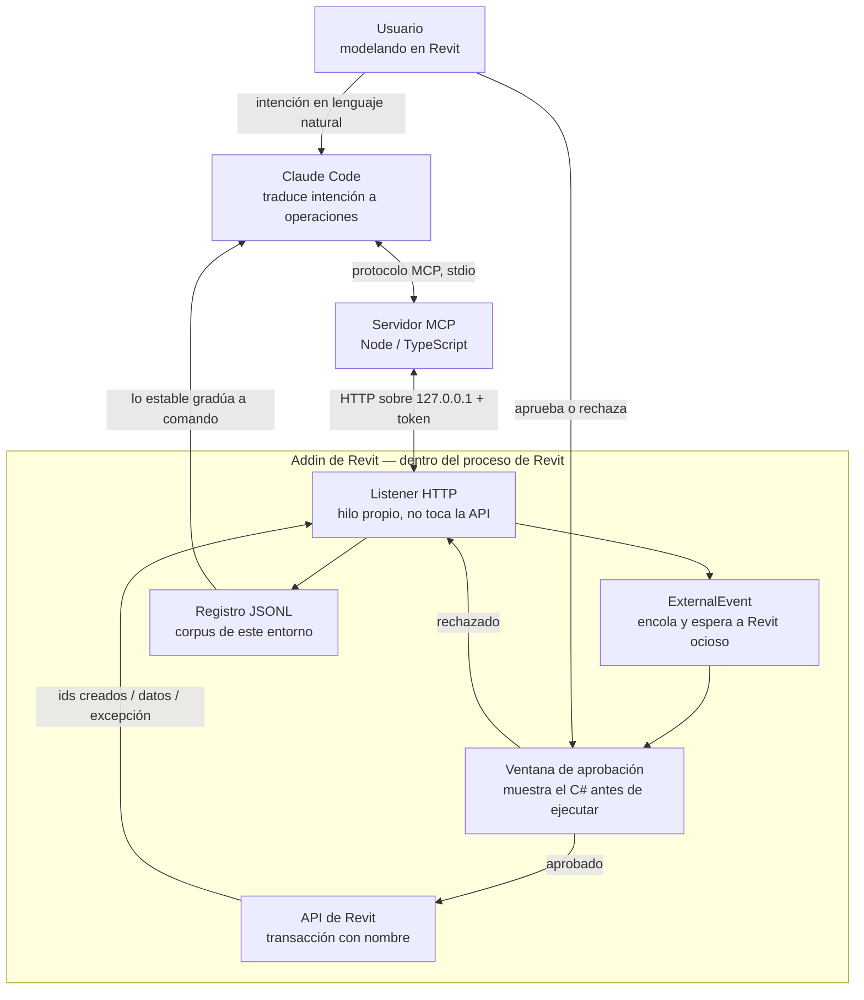

# ProductSpec — PROMPT_TO_REVIT

> [!abstract] Metadata
> | | |
> |---|---|
> | **Status** | 🟡 Draft |
> | **Owner** | Usuario único — arquitecto / desarrollador de plugins de Revit |
> | **Created** | 2026-08-17 |
> | **Updated** | 2026-08-17 |
> | **Version** | v0.1 |

---

## 🎯 Vision

Una pasarela que permite modelar y consultar en Revit desde la conversación con Claude, sin cerrar
Revit, sin recompilar nada y sin interrumpir el modelado manual. Todo lo que hace es reversible y
lo que funciona se acumula para la siguiente vez.

---

## 🔥 Problem Statement

| Pain | Root Cause |
|------|-----------|
| Automatizar una tarea nueva exige escribir un plugin, cerrar Revit, compilar y reabrir — minutos por iteración, para una operación que se usará una vez | El código de un addin se enlaza al arrancar Revit y su DLL queda bloqueado mientras Revit está abierto: no hay forma de introducir lógica nueva en una sesión viva |
| Claude escribe código de Revit que no compila, o que compila y falla contra el modelo real | El corpus público de la API apunta mayormente a Revit 2015-2020 y no conoce **este** entorno: esta plantilla, estas familias cargadas, estos nombres de tipo reales |
| Consultar el modelo (contar, verificar parámetros, encontrar inconsistencias) son clics repetidos en la UI | Revit no expone consultas compuestas: cada pregunta que cruza dos criterios hay que resolverla a mano o con un plugin dedicado |
| Cada error de la API se vuelve a descubrir desde cero en el siguiente proyecto | No hay registro de qué se intentó, qué falló y por qué; el conocimiento vive en la cabeza del usuario o en un `.md` alimentado a mano |
| Ejecutar código generado por un modelo sobre el modelo vivo da miedo, con razón | Sin transacciones nombradas, sin revisión previa y sin rollback, un error contamina el archivo y no hay forma de acotar el daño |
| Cualquier automatización que interrumpa el modelado en curso no se usa | Un plugin que abre un diálogo a mitad de un comando de Revit rompe el flujo de trabajo; se desinstala aunque funcione |

---

## 👤 Target User

- 🎯 **Primary** — El propio autor: arquitecto que desarrolla plugins de Revit en C# y modela a diario en Revit 2026. Sabe leer C#, sabe lo que la API puede y no puede hacer, y **puede juzgar un snippet antes de aprobarlo**. Usa la herramienta en su propia máquina, sobre archivos locales.
- 👥 **Secondary** — Ninguno en esta versión. La v1 se construye para un solo usuario, pero **sin decisiones que impidan distribuirla después**: nada de rutas fijas ni supuestos sobre esta máquina concreta (ADR-010 del TechSpec).
- 🌍 **Stretch** — Otros modeladores del estudio, si el núcleo se demuestra estable. Exigiría asumir un usuario que **no** sabe leer el snippet que aprueba, lo que cambia el diseño de la salvaguarda más importante. Es el objetivo declarado, y lo que todavía no está resuelto.

---

## 💎 Design Principles

- **Leer antes de escribir** — Ninguna operación de escritura parte de un nombre escrito a mano. Primero se resuelven los `ElementId` reales contra el documento abierto; el código usa ids. Los nombres dependen de la plantilla y de qué familias estén cargadas, así que un nombre inventado es un fallo garantizado, no un riesgo.
- **Diferir, nunca interrumpir** — Toda entrada a la API se encola y espera a que Revit quede ocioso. Si el usuario está en mitad de un comando, la petición aguarda. Una herramienta que corta el modelado no se usa, por útil que sea.
- **Reversible o no se hace** — Una transacción con nombre por operación, identificable en el historial de deshacer. Una operación que no se puede deshacer no entra en el producto.
- **El commandset es producción; Roslyn es el laboratorio** — La vía por defecto es siempre el código ya probado. Improvisar es la excepción, se declara al usarla, y lo que se demuestra estable gradúa a comando compilado.
- **La revisión humana es el producto, no un trámite** — El snippet se muestra legible antes de tocar el modelo. Un snippet que no se puede juzgar de un vistazo está mal escrito. Nada se ejecuta a ciegas.
- **Lo que funciona se acumula** — Cada ejecución alimenta un corpus de este entorno concreto. Ningún descubrimiento se re-deriva dos veces.

---

## 🏗️ Architecture



**Roles y límites de responsabilidad:**

- **Claude Code** — Traduce la intención del usuario a operaciones de la pasarela y decide la vía. **No** conoce el modelo: todo lo que sabe de él viene de una consulta previa. **No** ejecuta nada por su cuenta.
- **Servidor MCP** — Transporte y superficie de herramientas. Publica los comandos compilados como herramientas individuales tipadas, y la ejecución de C# como una sola herramienta marcada como escotilla de emergencia. **No** puede tocar la API de Revit: no existe en su proceso.
- **Listener HTTP** — Recibe, autentica y responde. Vive en su propio hilo y **jamás** llama a la API. Bloquea hasta tener el resultado real; nunca responde "aceptado" en vacío.
- **ExternalEvent** — Único puente al contexto de la API. Encola la petición y la ejecuta cuando Revit está ocioso. **No** prioriza, **no** cancela y **no** interrumpe al usuario.
- **Ventana de aprobación** — Muestra el código y espera decisión humana. Es la salvaguarda principal. **No** modifica el snippet ni lo corrige.
- **API de Revit** — Ejecuta dentro de una transacción con nombre. **No** guarda en disco, **no** abre otros documentos y **no** borra sin una vía dedicada con confirmación.
- **Registro JSONL** — Acumula qué se intentó y qué pasó. **No** es telemetría ni entrenamiento: es contexto que se vuelve a cargar.

---

## 🛠️ Interfaces

Todas las operaciones se sirven por un canal local restringido al usuario actual y se exponen a
Claude como herramientas MCP. El transporte concreto lo fija el TechSpec (named pipe, ver ADR-002).

### Operaciones de lectura — sin transacción, aprobación automática

#### `GET /commands`

Lista los comandos compilados disponibles. Es el primer paso obligatorio antes de considerar
ejecutar C#: si un comando cubre la operación, se usa ese.

| Param | Type | Default | Description |
|---|---|---|---|
| — | — | — | Sin parámetros |

#### `POST /query`

Lectura del modelo abierto: niveles, tipos, símbolos, parámetros, selección actual, mediciones.
Resuelve los `ElementId` reales que usará cualquier operación de escritura posterior.

| Param | Type | Default | Description |
|---|---|---|---|
| `consulta` | string | ✳️ required | Qué se quiere leer del documento activo |
| `filtros` | object | `{}` | Criterios de acotación: categoría, vista, tipo |

#### `POST /compile`

Dry-run: compila el snippet y devuelve los diagnósticos **sin ejecutarlo**. Valida sintaxis y tipos
sin tocar el modelo. Un fallo aquí cuesta ~1 s; el mismo fallo en runtime cuesta mucho más.

| Param | Type | Default | Description |
|---|---|---|---|
| `fuente` | string | ✳️ required | Código C# con la firma de `Script.Execute` |

### Operaciones de escritura — con transacción

#### `POST /exec`

Ejecuta C# dentro de una `Transaction` con nombre. Escotilla de emergencia: solo cuando ninguna
otra operación cubre el caso.

| Param | Type | Default | Description |
|---|---|---|---|
| `fuente` | string | ✳️ required | Código C# con la firma de `Script.Execute` |
| `intencion` | string | ✳️ required | Descripción en lenguaje natural; nombra la transacción como `Claude: <intención>` |

> [!warning] Efectos secundarios
> Modifica el modelo abierto. **Exige aprobación humana manual siempre** en la v1. El ámbito por
> defecto es lo creado en esta sesión; modificar elementos preexistentes exige intención explícita
> y borrar exige confirmación con previsualización.

#### `POST /command`

Invoca un comando compilado del catálogo. Es la vía preferente: código ya probado, con esquema
tipado y latencia inmediata.

| Param | Type | Default | Description |
|---|---|---|---|
| `nombre` | string | ✳️ required | Nombre exacto del comando; debe coincidir byte a byte con el catálogo |
| `argumentos` | object | `{}` | Parámetros tipados según el esquema del comando |

#### `POST /rollback`

Borra los elementos creados en la sesión. Cinturón además del Ctrl+Z del usuario.

| Param | Type | Default | Description |
|---|---|---|---|
| `hasta` | string | — | Marca temporal opcional; por defecto toda la sesión |

> [!warning] Efectos secundarios
> Borra elementos. Aprobación manual siempre, con previsualización de cuántos elementos y de qué
> categorías antes de ejecutar.

### Formato de respuesta

<details>
<summary>Respuesta común a todas las operaciones</summary>

```json
{
  "ok": false,
  "fase": "runtime",
  "resultado": null,
  "ids_creados": [],
  "error": "InvalidOperationException: ...",
  "traza": "...",
  "duracion_ms": 340
}
```

`fase` es `compilacion`, `runtime` u `ok`, y determina el triaje: un fallo de compilación es casi
siempre una API rota por versión; un fallo de runtime es casi siempre un supuesto falso sobre el
documento, y se corrige volviendo a consultar, no reintentando el mismo snippet.

La excepción se devuelve **completa**, con la cadena de `InnerException` y el nombre del tipo como
respaldo: varias excepciones de la API llegan con el mensaje vacío.

</details>

---

## ⚙️ Configuration

Fichero de configuración local en `%APPDATA%\RevitBridge\config.json`, leído por el addin al
arrancar. Al ser una herramienta de un solo usuario en su propia máquina, todo tiene un valor por
defecto razonable y el addin genera lo que falta.

| Variable | Default | Description |
|---|---|---|
| `puerto` | `8765` | Puerto del listener. Siempre en `127.0.0.1`; no es configurable a otra interfaz |
| `token` | generado | Token exigido en cabecera. Si no existe, el addin lo genera y lo escribe en el fichero |
| `timeout_ms` | `30000` | Espera máxima de la petición HTTP antes de devolver error. No cancela la ejecución en Revit: Revit es monohilo y no hay timeout real |
| `dir_log` | `%APPDATA%\RevitBridge\log\` | Destino del registro JSONL |
| `aprobacion_exec` | `manual` | Nivel de aprobación de `/exec`. En la v1 solo admite `manual` |
| `max_tam_snippet` | — | Tamaño máximo del snippet aceptado. Pendiente de calibrar con uso real |

**Mínimo para arrancar: cero variables.** El addin funciona con los valores por defecto y genera el
token en el primer arranque. Los nombres son provisionales hasta el TechSpec.

---

## 🩺 Operations

### Healthcheck

Dos niveles, porque comprueban cosas distintas:

- **Listener vivo** — `GET /commands` responde 200 con el catálogo. Confirma que el addin está
  cargado y el hilo del listener escucha. **No** confirma que Revit pueda ejecutar nada.
- **Ida y vuelta completa** — un `/query` trivial (el nombre del documento activo) que atraviesa el
  `ExternalEvent`. Es el único healthcheck real: confirma que Revit está ocioso y respondiendo. Si
  este se agota por timeout con el anterior en verde, Revit está ocupado o con un diálogo abierto —
  no es un fallo, es el diseño funcionando.

### Logging

Una línea JSON por ejecución en `%APPDATA%\RevitBridge\log\YYYY-MM.jsonl`, con la intención, la vía
usada, la fuente, la fase, el resultado, los ids creados y la duración.

Dos reglas que no son negociables:

- **Se escribe antes de ejecutar**, no después. Si Revit cae, tiene que quedar la evidencia de qué
  lo tumbó — que es precisamente el caso en el que un log escrito después no existe.
- **El error se registra completo**, con la traza y el tipo de excepción. Un log que dice "falló" no
  sirve para nada, y es lo que se obtiene por defecto con la mitad de las excepciones de la API.

El log no es telemetría: es el corpus del producto. Lo valioso no es la geometría, es que captura
**este** entorno — esta plantilla, estas familias, estos nombres reales. Es justo lo que ningún
conocimiento general aporta y es el modo de fallo principal del modelo.

---

## 📦 Deliverables

| Deliverable | Description |
|:---:|---|
| 🔌 **Addin de Revit** | Listener HTTP, compilación en memoria, `ExternalEvent`, transacciones, ventana de aprobación y registro. Es el único componente que toca la API |
| 🌐 **Servidor MCP** | Node/TypeScript. Declaración de herramientas con esquemas, transporte stdio, cliente HTTP contra el addin, propagación íntegra de errores |
| 📚 **Commandset** | Catálogo de comandos compilados, poblado por graduación de lo que se usa. Parte se adopta de `mcp-servers-for-revit` |
| 🧰 **DLL de utilidades** | Referenciada en cada compilación, para que el código generado invoque lo ya probado en vez de re-derivarlo y repetir errores resueltos |
| 🧠 **Corpus acumulado** | Registro JSONL + las entradas destiladas a `revit_api_knowledge.md`. Es lo que hace que la siguiente sesión empiece más arriba |
| 📖 **Documentación** | `DOCUMENTACION.md` como autoridad de diseño y `CLAUDE.md` con la regla de precedencia. Sin docs de instalación para terceros: usuario único |

---

## 🗂️ Project Structure

> [!abstract]- Árbol de ficheros (planificado — nada implementado todavía)
> ```
> 2605_PROMPT_TO_REVIT/
> ├── specs/
> │   ├── product-spec.md              # este fichero: el qué y el por qué
> │   ├── tech-spec.md                 # el cómo técnico
> │   └── roadmap.md                   # fases y dependencias
> ├── src/
> │   ├── RevitBridge.Addin/           # el único componente que toca la API de Revit
> │   │   ├── App.cs                   # IExternalApplication, arranque del listener
> │   │   ├── Bridge/                  # listener, Roslyn, filtro sintáctico, ExternalEvent
> │   │   ├── Commands/                # commandset compilado
> │   │   ├── UI/                      # ventana de aprobación, modeless
> │   │   └── RevitBridge.Addin.csproj
> │   ├── RevitBridge.Utils/           # utilidades probadas, referenciadas en cada compilación
> │   └── mcp-server/                  # Node/TypeScript
> │       ├── src/tools/               # declaración de herramientas y esquemas
> │       └── package.json
> ├── .claude/
> │   ├── agents/                      # revit-developer, mcp-developer + catálogo aisy
> │   └── skills/                      # revit-bridge, revit-api-2026, harvest-bridge-log
> ├── CLAUDE.md                        # regla de precedencia commandset → Roslyn
> └── DOCUMENTACION.md                 # autoridad de diseño
> ```

---

## 🚫 Out of Scope

- **Bridge de Python (pyRevit / RevitPythonShell)** — "Commandset vs Roslyn" es *cuándo se compila*; "C# vs Python" es *qué lenguaje*. Un bridge de Python **ya es** el equivalente a Roslyn: no aporta nada que Roslyn no dé y duplica runtime.
- **Escritura en disco desde la pasarela** — Ni `Save`, ni `SaveAs`, ni exportaciones. Guarda el usuario, siempre. No es una limitación pendiente de resolver: es la decisión.
- **Multi-documento y documentos de familia** — Un solo documento activo. Abrir o modificar otros de forma implícita multiplica el daño posible sin aportar al caso de uso.
- **Cualquier acceso desde red** — Canal local exclusivamente. Esto es ejecución de código arbitrario: expuesto en red es una puerta trasera, no una feature.
- **Instalador y documentación de usuario** — Fuera de la v1. La herramienta **se diseña para ser distribuible** (sin rutas ni supuestos de entorno empotrados, ver ADR-010 del TechSpec), pero empaquetarla antes de que el núcleo esté probado es trabajo sobre algo que aún puede fracasar.
- **Soporte multi-versión de Revit** — Solo 2026 (.NET 8). Las versiones 2020-2024 usan .NET Framework 4.8 y exigirían un segundo target sin beneficio actual.
- **Timeout real de ejecución** — Técnicamente imposible: Revit es monohilo y un bucle infinito lo congela sin poder matarlo desde fuera sin perder el trabajo. Se mitiga con cota obligatoria de iteraciones, dry-run y revisión humana. Es el punto débil real del diseño y se documenta como tal, no se promete resuelto.
- **Fine-tuning o dataset de snippets verificados** — No existe tal dataset para la API de Revit, y el mecanismo elegido es acumular contexto, no entrenar.

---

## 🔮 Future

- **Graduación asistida de snippets a comandos compilados** — Que el análisis del log proponga candidatos con su evidencia. En la v1 la graduación es manual y pasa por el flujo normal de desarrollo.
- **"Confiar durante 30 minutos"** — Saltar la aprobación manual de `/exec` en ámbito de sesión. Descartado para la v1 a propósito: mientras el sistema no se haya demostrado, la revisión humana no debe tener agujeros.
- **Rollback de modificaciones**, no solo de creaciones — Exige capturar el valor anterior de cada parámetro tocado. Ver Discovery.
- **Distribución al estudio** — Cambiaría la salvaguarda principal: habría que asumir un usuario que no puede juzgar el snippet que aprueba.
- **Soporte de Revit 2027** — Cuando exista y el núcleo esté estable.

---

## ❓ Discovery

- [x] ~~¿Qué cubre el producto: solo el addin o toda la pasarela?~~ → **Toda la pasarela**: servidor MCP, addin, commandset y ciclo de log y graduación, aunque parte del commandset se adopte de `mcp-servers-for-revit`.
- [x] ~~¿Usuario único o distribuible?~~ → **Usuario único, su propia máquina**. Elimina instalador, gestión de credenciales y docs de terceros del alcance.
- [x] ~~¿Cuál es el caso de uso dominante?~~ → **Los tres por igual** (consultar/auditar, modelar por lotes, prototipar lógica que gradúa). Sin sesgo declarado; la prioridad real la decidirá el log de uso.
- [x] ~~¿La ventana de aprobación es modal o modeless?~~ → **Modeless**, para no romper el principio de no interrumpir. Contrapartida aceptada: una petición puede quedar desatendida hasta agotar el timeout.
- [x] ~~¿Entra "confiar 30 min" en la v1?~~ → **No**. Aprobación manual siempre para `/exec`. Se acepta la fricción mientras el sistema no sea de confianza.
- [ ] ¿`/rollback` cubre también deshacer modificaciones de elementos preexistentes, o solo borrar lo creado? Requiere capturar el valor anterior de cada parámetro antes de escribirlo — bastante más trabajo, bastante más robusto.
- [x] ~~¿Qué pasa cuando la ventana modeless queda desatendida y la petición agota el timeout?~~ → **Rechazo automático** sin ejecutar. El caso por defecto es no tocar el modelo. Ver ADR-009 del TechSpec.
- [ ] ¿Cuál es el umbral para que un snippet gradúe a comando compilado? Repetición, estabilidad y coste son las señales, pero el corte concreto está sin fijar.
- [x] ~~¿El commandset adoptado se consume upstream o se bifurca?~~ → **Ninguno de los dos**: `mcp-servers-for-revit` queda como referencia conceptual y el código es propio. Sin dependencia externa que sincronizar.
- [ ] ¿Tamaño máximo de snippet y cota por defecto de iteraciones? Pendiente de calibrar con uso real.
