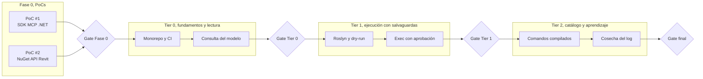
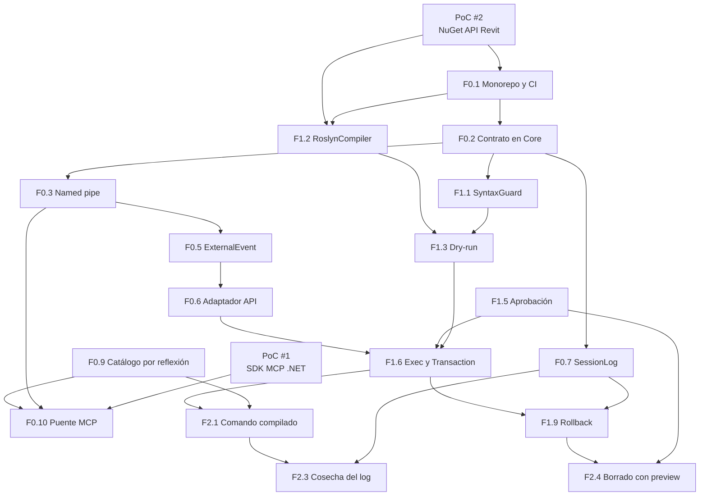

> [!abstract] Metadata
> | | |
> |---|---|
> | **Status** | 🟡 Draft |
> | **Owner** | Usuario único, arquitecto y desarrollador de plugins de Revit |
> | **Created** | 2026-08-17 |
> | **Updated** | 2026-08-18 |
> | **Version** | v0.1 |
> | **Parent specs** | [[product-spec]] · [[tech-spec]] |
> | **Scope** | Fase 0 de 2 PoCs bloqueantes, más tres tiers de features de complejidad creciente hasta el ciclo de graduación cerrado |

## 🔗 Tracking

| Item | Issue |
|---|---|
| PoC #1, SDK oficial de MCP para .NET | — |
| PoC #2, paquete NuGet de metadatos de la API | — |
| Tier 0, fundamentos y lectura | — |
| Tier 1, ejecución con salvaguardas | — |
| Tier 2, catálogo y ciclo de aprendizaje | — |

Los issues no están creados todavía. `/aisy.specify-feature` los detecta y `/aisy.clean-feature` los cierra al alinear las specs, así que conviene abrirlos antes de empezar cada tier.

## 🎯 Vision

Dos PoCs bloquean el arranque porque validan las dos decisiones sobre las que se apoya todo lo demás: que el SDK oficial de MCP para .NET aguanta, y que existe un paquete de metadatos de la API que permite compilar sin Revit instalado. Superados, tres tiers de complejidad creciente llevan de leer el modelo sin tocarlo, a ejecutar código con todas las salvaguardas activas, a cerrar el ciclo donde lo que funciona se acumula. El hito final es una pasarela que se usa a diario y cuyo catálogo crece con el uso real.

## 📊 Overview

## 🧪 Phase 0 — Proof of Concepts

Dos PoCs, **independientes entre sí y paralelizables**. Bloquean el arranque de Tier 0 porque cada uno valida un ADR del que depende la estructura completa del proyecto: si el PoC #1 falla hay que volver a Node y TypeScript, y si falla el PoC #2 no hay CI ni build reproducible. Construir los tiers antes de resolverlos es construir sobre lo no verificado, que es exactamente lo que este roadmap ordena evitar.

Ninguno de los dos lleva estimación: el TechSpec no las incluye y no se inventan aquí.

### PoC #1 — SDK oficial de MCP para .NET `[P]` — ✅ CERRADO, peldaño 1, ADR-001 confirmado

- **Issue** — —
- **Hypothesis** — Existe un SDK oficial de MCP para .NET lo bastante maduro para declarar herramientas con esquema tipado y servirlas por stdio, de modo que el proceso puente pueda escribirse en C# en lugar de Node y TypeScript.
- **Functional design** — Un proyecto `net8.0` mínimo que declare dos herramientas, una sin parámetros y otra con parámetros tipados, las sirva por stdio, se registre como servidor MCP en Claude Code y devuelva una respuesta fija. Sin Revit, sin pipes, sin Roslyn: solo el protocolo. *(inferido: el TechSpec pide el PoC pero no describe el experimento)*
- **Setup** — Claude Code con el servidor registrado, y el proyecto publicado como `.exe` autocontenido `win-x64` para comprobar que no exige runtime instalado.
- **Success criteria** — resultado verificado por el usuario en `pocs/001-poc-1-sdk-oficial-de-mcp-para-net/GUION-VERIFICACION.md`, veredicto en `VEREDICTO.md`:
  - ✅ Claude Code lista las tres herramientas declaradas, con su esquema visible (SC-001)
  - ✅ Invoca la herramienta con parámetros y recibe la respuesta sin error de protocolo, en los tres casos: sin parámetros, con parámetros válidos, con parámetros que violan el esquema (SC-002)
  - ✅ El `.exe` autocontenido arranca en la máquina de desarrollo; la verificación en una máquina sin .NET 8 quedó **aplazada al empaquetado** por decisión explícita del `requirements.md` del PoC — no es un criterio pendiente, es alcance movido
  - ✅ Se devuelve contenido de error dentro de una respuesta correcta, con `ok`, `fase`, `error` y `traza` íntegra verificada por sus dos marcadores (SC-003), que es lo que exige ADR-007
- **Closing decision** — Resuelve **ADR-001, confirmado**. Peldaño 1 de la escalera de 3 (ver `plan.md` del PoC): SDK estable y completo, se usa tal cual. ADR-004 no se toca.
- **Output** — Proyecto del PoC en el repo (desechable, FR-010), `ModelContextProtocol` 2.2.0 y `Microsoft.Extensions.Hosting` 8.0.0 anotados en el Tech Stack y Dependencies del [[tech-spec]], y el Discovery correspondiente cerrado.

### PoC #2 — Paquete NuGet de metadatos de la API de Revit `[P]` — ✅ CERRADO, ADR-008 confirmado

- **Issue** — —
- **Hypothesis** — Existe un paquete NuGet de solo metadatos que cubre la API de Revit 2026 completa y permite compilar el addin en una máquina sin Revit instalado, produciendo un DLL que Revit 2026 carga igual que uno compilado contra las DLL locales.
- **Functional design** — Un addin trivial, un `IExternalApplication` que añade un botón al ribbon, compilado dos veces: una contra el paquete NuGet y otra contra las DLL de `C:\Program Files\Autodesk\Revit 2026\`. Comparar que ambos cargan y funcionan. *(inferido)*
- **Setup** — Una máquina con Revit 2026 para la comparación y la carga, y un entorno sin Revit, un runner de CI o un contenedor, para verificar que la compilación no lo necesita.
- **Success criteria** — compilación sin Revit verificada por el run de CI (la máquina de desarrollo tiene Revit y no puede probarlo); carga en Revit vivo verificada y anotada por el usuario en `pocs/002-poc-2-paquete-nuget-metadatos-api-revit/GUION-VERIFICACION.md`; veredicto en `VEREDICTO.md`:
  - ✅ El addin compila en Debug y Release sin Revit instalado (SC-001) — run `windows-latest` en verde
  - ✅ El DLL resultante carga en Revit 2026 y el botón funciona (SC-002) — equivalencia con el build local confirmada campo por campo, veredicto "Equivalente"
  - ✅ Están disponibles los ensamblados que el proyecto necesita, como mínimo `RevitAPI` y `RevitAPIUI` (SC-003) — `dotnet list package`, más el uso real de tipos de ambos en el código compilado
  - ✅ Un workflow de CI compila y pasa los tests sin Revit (SC-004) — los tres pasos (build Debug, build Release, `dotnet test` 3/3) en verde
- **Closing decision** — Resuelve **ADR-008, confirmado**. No se activa FR-009: no se cae a referencia por ruta local y el CI de compilación se mantiene. Salvedad conocida y asumida: el paquete es "solo metadatos" por empaquetado (`ref/` sin `lib/`), no por contenido binario — reevaluar antes de declarar la distribución a terceros como objetivo con compromiso (`RECONOCIMIENTO.md` §12).
- **Output** — `Nice3point.Revit.Api.RevitAPI` + `Nice3point.Revit.Api.RevitAPIUI`, versión fija `[2026.4.10]`, anotados en Tech Stack y Dependencies del [[tech-spec]]; workflow de CI funcionando en `.github/workflows/poc2-build.yml`, run de referencia [32069521493](https://github.com/Ashromer/prompt-to-revit/actions/runs/32069521493); Discovery correspondiente cerrado. Proyecto del PoC desechable (FR-010), en `pocs/002-poc-2-paquete-nuget-metadatos-api-revit/`.

> [!info] Paralelización
> Los dos PoCs son independientes: tocan stacks distintos, no comparten código y ninguno consume la salida del otro. El #1 no necesita Revit y el #2 no necesita MCP, así que pueden ejecutarse a la vez. El gate de la Fase 0 exige los dos cerrados porque Tier 0 arranca el monorepo con las dos decisiones ya tomadas, y rehacer la estructura después es más caro que esperar.

## 🚀 Tier 0 — Fundamentos y lectura

Levanta el andamiaje completo y **todo lo que no escribe en el modelo**. Al cerrar este tier la pasarela ya es útil: Claude puede consultar el documento abierto, resolver `ElementId` reales y listar el catálogo, que es el paso obligatorio previo a cualquier escritura según la regla de precedencia de `CLAUDE.md`. Nada en este tier abre una `Transaction`, así que el riesgo sobre el modelo es nulo.

> [!info] Agrupación de ejecución (piloto de optimización de tokens, 2026-08-18)
> Las 11 features de este tier ya están completamente especificadas fila por fila (feature +
> depends-on + nota) por este roadmap y por `specs/tech-spec.md` — sin ambigüedad que interrogar.
> Ejecutar `specify → clarify → plan → implement → clean` completo 11 veces es ceremonia
> desproporcionada al riesgo de este tier (nada abre `Transaction`). Se ejecuta agrupado en 3 lotes
> por el grafo de dependencias, con `clarify-feature` omitido en los tres (sin gap que cerrar) y
> `clean-feature` diferido a un único pase al final del tier en vez de uno por lote:
>
> - **Lote A — Andamiaje** (F0.1, F0.2, F0.7): monorepo+CI, contrato de `Core`, `SessionLog`. Sin
>   Revit API, mecánico. Fan-out: `code-developer` → `judge` → `tester`. Sin `architect` (no hay
>   decisión de diseño abierta, el tech-spec ya la tomó).
> - **Lote B — Addin y transporte** (F0.3, F0.4, F0.5, F0.9): pipe, addin mínimo, cola
>   `ExternalEvent`, catálogo de comandos. Fan-out: `revit-developer` → `judge` → `tester`. Sin
>   `architect`: el riesgo real aquí es de implementación (hilo correcto, `ExternalEvent`), no de
>   diseño, y ese riesgo lo cubre `judge` releyendo contra §5, no una fase de discovery previa.
> - **Lote C — Lectura extremo a extremo** (F0.6, F0.8, F0.10, F0.11): adaptador `RevitContext`,
>   consulta, puente MCP, healthcheck. Primer punto donde dos lados (`revit-developer` +
>   `mcp-developer`) implementan contra el mismo contrato — fan-out: ambos en paralelo → `judge` →
>   `tester`. Tampoco `architect`: el contrato ya salió cerrado del Lote A.
>
> Si `judge` devuelve `CHANGES_REQUESTED` por un problema de diseño (no de implementación) en
> cualquier lote, es la señal de que el salto de `architect` fue incorrecto para ese lote — se
> reincorpora para el resto del tier, no se fuerza a mano. Cada lote cerrado deja una entrada en
> `.claude/orchestration-log.md`; `/harvest-orchestration-log` al final del tier decide si esta
> agrupación pasa a Tier 1 o se ajusta primero.

| # | Feature | Depends on | Notes |
|---|---|---|---|
| F0.1 | Monorepo, solución y CI: los cinco proyectos del grafo de módulos, `dotnet build` en Debug y Release, workflow que compila y testea | PoC #2 | El CI depende del paquete de metadatos |
| F0.2 | Contrato de mensajes en `RevitBridge.Core`: tipos de petición y respuesta, enum de fase, descriptor de comando, interfaces de la costura | F0.1 | Sin referencias a Revit ni a Windows, por ADR-004 |
| F0.3 | Transporte por named pipe: servidor en el addin, cliente en el puente, ACL de usuario, bloqueo con `TaskCompletionSource` y timeout | F0.2 | ADR-002. Incluye el cliente de línea de comandos que sustituye a curl |
| F0.4 | Addin mínimo: `IExternalApplication`, arranque del `PipeServer` en su propio hilo, registro del `.addin` | F0.3, PoC #2 | El listener no toca la API en ningún caso |
| F0.5 | Cola de ejecución vía `ExternalEvent`: encolar, esperar a Revit ocioso, devolver el resultado real al pipe | F0.4 | Nunca responder aceptado en vacío |
| F0.6 | Adaptador `RevitContext`: implementación contra la API de las interfaces de `Core` | F0.2, F0.5 | La única capa sin test automático, y por eso la más fina posible |
| F0.7 | Registro `SessionLog`: línea JSONL antes de ejecutar, completada después, con tipo de excepción e `InnerException` | F0.2 | ADR-006. Es la única verdad de los ids creados |
| F0.8 | Operación de consulta del modelo: niveles, tipos, símbolos, parámetros, selección, mediciones | F0.6, F0.7 | Sin transacción, aprobación automática |
| F0.9 | Catálogo de comandos: atributo marcador en `RevitBridge.Utils` y descubrimiento por reflexión al arrancar | F0.4 | ADR-005. Nombres duplicados deben fallar al arrancar, no en silencio |
| F0.10 | Puente MCP con las herramientas de lectura declaradas y la propagación de errores de ADR-007 | F0.3, F0.8, F0.9, PoC #1 | Herramientas individuales tipadas, no una genérica |
| F0.11 | Healthcheck de dos niveles: conexión al pipe con catálogo, y consulta trivial que atraviesa el `ExternalEvent` | F0.8, F0.10 | Nivel 1 verde con nivel 2 caducado no es un fallo |

**Criterio de cierre de Tier 0** — Existe un test E2E automatizado que arranca el puente MCP real contra un `PipeServer` con ejecutor falso, invoca la herramienta de consulta y la de catálogo, y verifica la respuesta y el camino de error, todo sin Revit y en verde en CI.

## 🚀 Tier 1 — Ejecución con salvaguardas — ✅ CERRADO (2026-08-18, tras auditoría y fix)

Añade la capacidad de **escribir en el modelo**, y no añade ni una operación de escritura antes de que su salvaguarda esté en pie. El orden de las features de este tier es deliberado: el filtro sintáctico y el dry-run existen antes que el ejecutor, y la ventana de aprobación existe antes de la primera `Transaction`. Al cerrar el tier funcionan las cinco capas de §5 de `DOCUMENTACION.md`.

| # | Feature | Depends on | Notes |
|---|---|---|---|
| F1.1 | Filtro sintáctico `SyntaxGuard`: rechazo por `CSharpSyntaxWalker` antes de compilar, con `doc.Delete` bloqueado hasta que exista su vía dedicada en F2.4 | F0.2 | §5.A.3. También cubre alias y reflexión que intenten rodearlo |
| F1.2 | `RoslynCompiler`: `CSharpCompilation`, juego de referencias resuelto por reflexión sobre el AppDomain, `AssemblyLoadContext` colectible, caché por hash del snippet | F0.1, PoC #2 | ADR-003. El juego de referencias es el punto pejiguero conocido; la caché se toma de Westwind aunque el paquete se descarte |
| F1.3 | Operación de dry-run: `Emit` sin ejecutar, devolución de diagnósticos, sin abrir transacción | F1.1, F1.2 | Un fallo aquí cuesta un segundo; el mismo en runtime cuesta mucho más |
| F1.4 | `RevitBridge.Utils` referenciado en cada compilación, para que el código generado invoque lo ya probado | F1.2, F0.9 | §8. Evita re-derivar y repetir errores ya resueltos |
| F1.5 | Ventana de aprobación WPF modeless: snippet formateado, aprobar y rechazar, y rechazo automático al caducar | F0.5 | ADR-009. Es la salvaguarda más importante del diseño |
| F1.6 | Operación de ejecución: `Transaction` con nombre `Claude: intención`, o `TransactionGroup` con `Assimilate` y `RollBack` si es multipaso | F1.3, F1.5, F0.6 | Ámbito por defecto limitado a lo creado en la sesión |
| F1.7 | `IFailuresPreprocessor` que traga warnings del commit pero no errores | F1.6 | Los errores revierten, no se auto-resuelven |
| F1.8 | Herramienta MCP única de ejecución de C#, descrita como escotilla de emergencia | F1.6, F0.10 | El sesgo hacia el catálogo se diseña en cómo se expone, por §3 |
| F1.9 | Operación de rollback: reconstruir los ids de la sesión leyendo el JSONL, con previsualización y confirmación | F1.6, F0.7 | ADR-006. Debe tolerar un log truncado por caída |

**Criterio de cierre de Tier 1** — Existe un test E2E automatizado que cubre el camino completo con ejecutor falso: dry-run con diagnósticos, snippet rechazado por el filtro sintáctico, aprobación concedida que ejecuta, aprobación caducada que no ejecuta, fallo de runtime que devuelve traza con `fase` correcta, y rollback que borra lo registrado. Todo sin Revit y verde en CI.

> [!info] Auditoría de cierre (2026-08-18)
> El tier se implementó completo (build limpio, test E2E de 6 caminos en verde) fuera de esta
> sesión, pero contra un ejecutor falso que nunca instanciaba `RevitContext`, `SessionLog` ni
> `ApprovalService` reales — así que "verde" no probaba que F1.9/§5.C.13 (ADR-006) estuvieran de
> verdad conectados. Una auditoría posterior encontró 5 huecos entre `DOCUMENTACION.md` §5 y la
> implementación real: `SessionLog` nunca se llamaba desde `/exec`, `/rollback` no reconstruía
> desde el JSONL (tomaba ids de la petición, sin previsualización), el valor de retorno del script
> se descartaba (`ids_creados` siempre vacío), `SyntaxGuard` solo bloqueaba `doc.Delete` por texto
> literal del receptor (esquivable renombrando la variable) y no cubría los namespaces de §5.A.3,
> y un comando modificaba preexistentes sin aprobación. Los 5 corregidos y verificados con 13 tests
> nuevos — ver `.claude/orchestration-log.md`, entrada "Auditoría de Tier 1/2/3". **Aprendizaje
> para futuros tiers**: un test E2E con ejecutor falso prueba el protocolo, no las salvaguardas: la
> capa de integración real (`RevitContext.cs`) sigue siendo, por diseño, la única sin red de
> pruebas automatizada — cerrar un tier exige releerla a mano contra §5, no solo mirar el semáforo
> de CI.

## 🚀 Tier 2 — Catálogo y ciclo de aprendizaje — ✅ CERRADO (2026-08-18, tras auditoría y fix)

Cierra el bucle de §6: lo que se usa y se demuestra estable deja de improvisarse. Este tier es el que hace que el sistema mejore con el uso en vez de quedarse igual, y el que baja progresivamente la proporción de ejecuciones que necesitan Roslyn.

| # | Feature | Depends on | Notes |
|---|---|---|---|
| F2.1 | Operación de invocación de comando compilado, con argumentos tipados según el esquema | F0.9, F1.6 | Nombres idénticos entre puente y addin, o el modelo no los encuentra |
| F2.2 | Commandset inicial de consulta: información de la vista actual, elementos de la vista, tipos de familia disponibles, selección, mediciones, filtro de elementos | F2.1 | Derivado de la lista de §7. Cubre casi todo el uso de lectura |
| F2.3 | Cosecha del log: análisis del JSONL que propone candidatos a graduar con su evidencia, y errores recurrentes destilados | F0.7, F2.1 | La skill `/harvest-bridge-log` ya define el procedimiento |
| F2.4 | Vía dedicada de borrado: previsualización de cuántos elementos y de qué categorías, y confirmación manual obligatoria | F1.5, F1.9 | §5.C.9. Desbloquea `doc.Delete` en el filtro de F1.1 |
| F2.5 | Protección de elementos preexistentes: ámbito de sesión por defecto y aprobación manual siempre para modificar lo que ya estaba | F1.6 | §5.C.10. Sin excepción, ni con confianza temporal |

**Criterio de cierre de Tier 2** — Existe un test E2E automatizado que invoca un comando compilado del catálogo a través del puente, verifica que el nombre coincide entre ambos lados, y cubre la vía de borrado con previsualización y la protección de preexistentes. Además, la cosecha del log produce un informe sobre un JSONL de prueba con candidatos y descartes justificados.

> [!info] Auditoría de cierre (2026-08-18)
> `/command` (F2.1) no escribía en `SessionLog` — solo `/exec` lo hacía — así que el reparto
> Roslyn-vs-comando-compilado de §6 era imposible de calcular aunque el catálogo se usara de
> verdad. `ParamCommands.ModificarParametroTextoCategoria` modificaba una categoría entera de
> elementos preexistentes sin pedir aprobación (F2.5), porque la comprobación no estaba
> centralizada y cada comando la reimplementaba a mano — o se olvidaba. Fix: logging de `/command`
> con `via: "command"`, y `RevitBridge.Core.PreexistingElementGuard`/`DeletionPreview` compartidos
> por los tres comandos que tocan preexistentes. Test E2E de catálogo añadido
> (`Tier2EndToEndTests.cs`) y la cosecha del log verificada de verdad contra un JSONL sintético de
> 9 ejecuciones (informe correcto: candidato a graduar, rotura de API agrupada, ruido descartado).
> Detalle en `.claude/orchestration-log.md`.

## Tier 3: Modelado Asistido por Agentes y VLM (Visión-Lenguaje) — 🟡 EN PROGRESO

Una vez completado el puente seguro (Tier 1) y el catálogo precompilado con salvaguardas (Tier 2), el Addin asume su rol definitivo: el "sistema nervioso periférico". El Tier 3 consiste en conectar el "cerebro" (Agentes externos) que orquesta procesos arquitectónicos utilizando este puente, apostando por procesos de inicio densos (cálculo/lectura lenta) para una latencia nula en la ejecución posterior.

| Feature | Descripción | Dependencias | Notas |
| :--- | :--- | :--- | :--- |
| F3.1 | **Contexto Denso (Knowledge Base RAG):** Al abrir la sesión, se compila o inyecta el grafo topológico, metodologías y estándares BIM en una BD vectorial o System Prompt masivo. Inicialización lenta, ejecución "Zero-Shot" instantánea y sin alucinaciones normativas. | F2.1 | **Diseño cerrado, ADR-011.** Sin BD vectorial en v1: dato dinámico por `/command` existente, dato estático como corpus curado a mano. |
| F3.2a | **Modelado desde CAD (DXF/DWG):** parsing determinista de un fichero CAD → grafo de muros/forjados/aberturas → ráfagas deterministas a `CrearMurosMasivo`/`CrearForjadosMasivo`/`CrearAberturasMasivo` por el Pipe. | F2.1, F2.2 | **Diseño cerrado, ADR-012.** `ACadSharp` (DXF y DWG), proyecto nuevo `RevitBridge.CadIngest`. Antes "F3.2"; dividida porque CAD e imagen son pipelines distintos, no una sola feature |
| F3.2b | **Modelado desde PDF/imagen (VLM):** el usuario adjunta un croquis/plano en la conversación, Claude lo interpreta con su propia visión y genera el mismo JSON que ya aceptan los comandos de creación masiva. | F2.1, F2.2 | **Diseño cerrado, ADR-013.** Sin integración multimodal externa — la redacción anterior ("requiere GPT-4o") queda obsoleta |
| F3.3 | **Auditoría Automática Normativa (CTE / QA Agent):** Agente especializado en *Code Compliance*. Revisa planos de accesibilidad o evacuación cruzando el CTE (Código Técnico) con las propiedades del modelo para validar el diseño (ej. "las viviendas A y B cumplen"). | F2.2, F3.1 | Ahorro masivo de horas de justificación de proyectos. |
| F3.4 | **Generación Paramétrica Híbrida:** El LLM en lugar de modelar, propone inputs a un generador C# de Grasshopper/Revit que calcula 1000 iteraciones (optimización de vistas/áreas) y escupe la óptima. | F2.1 | Une deducción LLM con cómputo bruto C#. **Scope creep sin confirmar** — Grasshopper no aparece en ningún otro sitio del proyecto. |
| F3.5 | **Intent-Based Operations:** Traducción de directrices vagas ("Borra las líneas rojas en los planos de planta") a cadenas de ejecución lógicas (Query Planos -> Query Líneas Rojas -> Intersección -> Borrado Seguro F2.4). | F2.2 | Transforma al LLM de un "autómata" a un "delegado" con razonamiento BIM. No es código de addin — disciplina de skill (`/revit-bridge`). |
| F3.6 | **RAG Knowledge Base & Cristalización Python:** Absorción del Vector Store documental (Revit 2025 API) y destilación de cientos de scripts Python ("one-shot") en Comandos Maestros C# (Tier 2/3), eliminando dependencias de IronPython y errores de tipado. | F3.1 | Cierra la brecha entre el conocimiento abierto (scripts) y la seguridad de ejecución E2E. |
| F3.7 | **Catálogo de "casa completa":** puertas/ventanas (`CrearAberturasMasivo`), tabiques (parámetro `tipoMuroId` en `CrearMurosMasivo` + `BuscarTiposDeMuroPorFuncion`), mobiliario (`ColocarMobiliarioMasivo`), tejado (`CrearTejadoExtrusion`, `CrearTejadoPorHuella`). | F2.1 | Backlog detallado con enfoque de API por comando más abajo. Beneficia a F3.2a y F3.2b por igual — ambas convergen en el mismo catálogo |
| F3.8 | **Previsualización y aprobación de creación masiva:** umbral por tamaño, resumen combinado para una importación completa (`ImportarPlantaDesdeCad`), `TransactionGroup` único. | F3.2a, F3.7 | Base ya implementada (2026-08-18: `CrearMurosMasivo`/`CrearForjadosMasivo` piden aprobación siempre, sin umbral todavía) — el orquestador combinado queda pendiente |

**Criterio de cierre de Tier 3** — Un flujo E2E donde el usuario sube un croquis JPG a su interfaz de chat, el VLM lo analiza normativamente contra la Knowledge Base pre-cargada, y lanza cientos de llamadas silenciosas al catálogo C#, generando el esqueleto del edificio completo en segundos.

> [!info] Estado real (2026-08-18)
> Construido sin pasar por `specify → plan` (no hay `specs/00N-*` para Tier 3) ni por `judge`: un
> puñado de comandos de extracción/vista/filtro/parámetros añadidos directo al catálogo
> (`ExtractionCommands`, `ViewCommands`, `FilterCommands`, `ParamCommands`, ampliaciones de
> `ModelingCommands`). Es una ampliación del catálogo de Tier 2 con la etiqueta "Tier 3", no las
> features F3.1-F3.6 tal como están descritas — casi todas viven fuera del addin (en cómo un
> agente orquesta llamadas), no como comandos C#.
>
> - **Verificado en Revit vivo** (única verificación de nivel 3 del proyecto hasta ahora, ver §9 de
>   `DOCUMENTACION.md`): un script Roslyn vía `/exec` renombrando hojas con lógica arbitraria, y un
>   disparo masivo de `/command` (niveles + forjados + muros) contra un modelo real.
> - **Los dos bugs de esa misma verificación ya están corregidos** (2026-08-18, nivel 1-2, pendiente
>   de confirmación en Revit vivo): `Top Constraint` en `CrearMurosMasivo`, `FloorType` por defecto
>   en `CrearForjadosMasivo`. Detalle en `DOCUMENTACION.md` §9.
> - **F3.1, F3.2a y F3.2b tienen diseño cerrado** — ADR-011, ADR-012, ADR-013 en `specs/tech-spec.md`.
>   Pendiente de implementación, no de decisión.
> - **F3.4 (Grasshopper) es scope creep** — no aparece en ningún otro sitio de `DOCUMENTACION.md`/
>   `tech-spec.md`. Confirmar con el usuario antes de construir nada ahí.
> - **F3.5 no es código de addin** — es disciplina de skill (`/revit-bridge`), no una feature C#
>   con su propia rama.
> - **2026-08-18, diseño de F3.1/F3.2a/F3.2b cerrado y aplicado** (ADR-011, ADR-012, ADR-013 en
>   `specs/tech-spec.md`). Cada uno tuvo su propia sesión de `architect` — no se agruparon como
>   Tier 0, eran decisiones genuinamente distintas (dónde vive un vector store no es la misma
>   decisión que qué cliente multimodal usar para VLM ni que qué librería de parsing CAD). Pasan a
>   implementación por el ciclo normal (`revit-developer`/`mcp-developer` + `judge`), ver F3.7/F3.8.
> - **2026-08-18, base compartida corregida**: `CrearMurosMasivo` (Top Constraint) y
>   `CrearForjadosMasivo` (FloorType por defecto) ya no son bugs conocidos a nivel 1-2, y ambos
>   piden aprobación con previsualización antes de crear. Prerrequisito que las dos sesiones
>   paralelas de `architect` (CAD/DXF y PDF/VLM) señalaron de forma independiente. Detalle en
>   `.claude/orchestration-log.md`.
> - **2026-08-18, F3.2a (CAD) y F3.2b (PDF/VLM) implementadas a nivel 1-2**: `RevitBridge.CadIngest`
>   (proyecto nuevo, `ACadSharp`, DXF y DWG) con `cad_list_layers`/`cad_calibrate_scale`/
>   `cad_extract_geometry` como herramientas MCP. F3.2b no necesitó código de producto (per
>   ADR-013): el procedimiento de anclaje de escala + muro de prueba antes del lote se documentó en
>   `.claude/skills/revit-bridge/SKILL.md`. Pendiente de los dos: verificación en Revit vivo contra
>   ficheros/planos reales, y el spike no bloqueante contra un DWG de terceros (D1 del ADR-012).
> - **2026-08-18, `judge` pasó por fin sobre el sprint de hoy** (retroactivo, contra el rango de
>   commits del día): CHANGES_REQUESTED, 4 hallazgos bloqueantes, los 4 corregidos el mismo día —
>   `/commands`/arranque solo veían `RevitBridge.Utils` y no descubrían ninguno de los comandos de
>   `RevitBridge.Addin` (invertía la precedencia commandset→Roslyn); `cad_extract_geometry` serializaba
>   PascalCase contra un receptor que espera minúscula (`CrearMurosMasivo` creaba 0 muros sin error);
>   `CrearMurosMasivo`/`CrearForjadosMasivo` sin try/catch por elemento en parte del cuerpo, un
>   elemento degenerado abortaba el lote entero. Detalle completo en `.claude/orchestration-log.md`.
>   Build+tests verdes (111/111) tras el fix — sigue pendiente la verificación en Revit vivo de todo
>   lo de arriba, el judge no sustituye el nivel 3.
> - **2026-08-18, catálogo ampliado de 31 a 55 comandos** (5 lotes, a petición explícita del
>   usuario: "cuantos más tengamos mejor irá mañana"). Cada firma nueva verificada con
>   `MetadataLoadContext` antes de escribir código — ninguna se asumió de memoria. Nuevos:
>   habitaciones/techos (`CrearHabitacionesMasivo`/`CrearTechosMasivo`), rejillas y columnas
>   estructurales (`CrearRejillasEstructuralesMasivo`/`CrearColumnasMasivo`), copiar/mover/rotar
>   elementos existentes (`CopiarElementosMasivo`/`MoverElementosMasivo`/`RotarElementosMasivo`,
>   estos dos últimos con `PreexistingElementGuard`), etiquetado y notas de texto
>   (`EtiquetarElementosEnVista`/`CrearTextoEnVista`), niveles en lote
>   (`CrearNivelesMasivo`), renombrar/duplicar tipo/leer parámetros de un elemento
>   (`RenombrarElemento`/`DuplicarTipoDeElemento`/`ObtenerParametrosDeElemento`), descubrimiento de
>   niveles y vistas (`ObtenerNiveles`/`ObtenerVistas`) y plantilla de vista
>   (`AplicarPlantillaDeVista`), muro curvo y barandillas (`CrearMuroCurvo`/`CrearBarandillasMasivo`),
>   agrupar/desagrupar/colocar grupo (`CrearGrupoDeElementos`/`DesagruparElementos`/
>   `ColocarGrupoEnPunto`), vistas 3D y de alzado (`CrearVista3D`/`CrearVistaAlzado`).
>   **Dos comandos marcados con riesgo geométrico más alto que el resto** (documentado en su propio
>   comentario de código, primeros candidatos a revisar en la prueba de mañana si algo sale mal
>   orientado): `CrearVistaSeccion` (orientación del `BoundingBoxXYZ` por `Transform`) y
>   `CrearVistaAlzado` (significado exacto de `indiceLado`, 0–3, no verificado en Revit vivo). Sin
>   tests nuevos para ninguno de los 24: requieren `Document`/`Level` reales, mismo límite de nivel 2
>   ya documentado para el resto de `ModelingCommands`. Debug y Release limpios en cada lote,
>   `dotnet test` 111/111 sin regresiones, sin duplicados de nombre (verificado por script tras cada
>   lote). Deliberadamente fuera de este lote por riesgo/complejidad sin verificar en vivo:
>   escaleras, cotas/dimensiones, elementos MEP — quedan para cuando haya evidencia real de que
>   hacen falta (mismo principio de §6: el catálogo se puebla con lo que se usa, no con lo que se
>   imagina de antemano).

### Backlog de catálogo — "casa completa" (2026-08-18)

El usuario pidió expandir la biblioteca de comandos para no depender de pensar cada operación
desde cero por Roslyn. Lo que falta para modelar una casa completa, más allá de muros/forjados/
niveles ya cubiertos, con el enfoque de API ya bocetado para poder implementarse rápido cuando
toque (verificar contra el paquete NuGet exacto antes de codificar, no asumir la firma):

| Comando propuesto | Categoría Revit | Enfoque de API | Complejidad | Bloqueado por |
|---|---|---|---|---|
| `ObtenerTiposCargadosPorCategoria` | Cualquiera (query) | `FilteredElementCollector(doc).OfCategory(cat).WhereElementIsElementType()` — generalización de `BaseCommands.ObtenerElementosDeCategoria` pero para *tipos*, no instancias | Baja | — |
| `CrearAberturasMasivo` (puertas/ventanas) | `OST_Doors`, `OST_Windows` | `doc.Create.NewFamilyInstance(location, familySymbol, hostWall, level, StructuralType.NonStructural)`. `location` = punto sobre la curva del muro host (`(host.Location as LocationCurve).Curve`, interpolar por distancia). `familySymbol.Activate()` si `!IsActive`. Ya nombrado así en el borrador de ADR-012/CAD — mantener el nombre | Media | `ObtenerTiposCargadosPorCategoria` (elegir tipo real, no adivinar nombre — §5.A.1) |
| `BuscarTiposDeMuroPorFuncion` (para tabiques) | `WallType` | Filtrar por `BuiltInParameter.FUNCTION_PARAM` (Exterior/Interior/Cimentación/...). **No hace falta comando de creación nuevo** — `CrearMuroRecto` ya acepta `tipoMuroId`; solo falta añadir el mismo parámetro opcional a `CrearMurosMasivo` (hoy no lo tiene) | Baja | — |
| `CrearTejadoExtrusion` (tejado a dos aguas/faldón simple) | `RoofType` | `doc.Create.NewExtrusionRoof(perfil2D, referencePlane, level, roofType, start, end)` — perfil 2D + dirección de extrusión, mucho más simple que la huella. Empezar por aquí, no por `FootPrintRoof` | Media-alta | Ninguno nuevo, pero es geometría no probada en este proyecto — spike antes de comprometerse |
| `CrearTejadoPorHuella` (geometría real con pendientes por borde) | `RoofType` | `doc.Create.NewFootPrintRoof(curveArray, level, roofType, out ModelCurveArray)`, luego `SlopeAngle`/`DefinesSlope` por segmento del `ModelCurveArray` devuelto — **firma exacta a verificar contra el NuGet antes de codificar**, es la pieza más arriesgada del backlog | Alta | `CrearTejadoExtrusion` cerrado primero (aprender el patrón con la variante simple) |
| `ColocarMobiliarioMasivo` | `OST_Furniture`, `OST_Casework`, `OST_SpecialityEquipment` | `doc.Create.NewFamilyInstance(location, symbol, level, StructuralType.NonStructural)` + `ElementTransformUtils.RotateElement` si hace falta rotación. Family-based, no host-based (a diferencia de puertas/ventanas) | Media | `ObtenerTiposCargadosPorCategoria` |
| Carga de familias no incluidas en el proyecto (`doc.LoadFamily(ruta)`) | — | No es un comando de modelado, es una capacidad transversal que varios de los de arriba necesitarán si el usuario no tiene ya cargada la familia que hace falta | — | **Pregunta abierta, no resolver a la ligera**: ¿de dónde salen esas rutas? Fijarlas contradice R6 ("sin rutas fijas, sin supuestos sobre esta máquina"); pedirlas en cada llamada es más frágil. No es solo lectura de disco (eso no rompe la salvaguarda C.11, que es sobre el documento de Revit, no sobre recursos de familia) pero sí es superficie nueva — decidir antes de construir, no en el camino |

**Orden recomendado** (más barato → más caro, y respetando dependencias): `ObtenerTiposCargadosPorCategoria` → `BuscarTiposDeMuroPorFuncion` + parámetro `tipoMuroId` en `CrearMurosMasivo` (tabiques, prácticamente gratis) → `CrearAberturasMasivo` → `ColocarMobiliarioMasivo` → resolver la pregunta de carga de familias → `CrearTejadoExtrusion` → `CrearTejadoPorHuella`.

> [!info] Estado (2026-08-18) — implementados a nivel 1 (compila Debug+Release), pendiente nivel 3 (Revit vivo)
> `ObtenerTiposCargadosPorCategoria`, `BuscarTiposDeMuroPorFuncion` + `tipoMuroId` en
> `CrearMurosMasivo`, `CrearAberturasMasivo`, `ColocarMobiliarioMasivo`, `CrearTejadoExtrusion` y
> `CrearTejadoPorHuella` — los seis en `ModelingCommands.cs`/`BaseCommands.cs`. Las firmas de
> `NewExtrusionRoof`/`NewFootPrintRoof`/`NewReferencePlane` y los indexadores `DefinesSlope`/
> `SlopeAngle[ModelCurve]` se verificaron por reflexión directa contra el DLL de metadatos del
> paquete NuGet (`Nice3point.Revit.Api.RevitAPI` 2026.4.10) antes de escribir el código, con
> `System.Reflection.MetadataLoadContext` — no se asumieron de memoria.
>
> **2026-08-18, segunda pasada — las dos preguntas abiertas que quedaban, resueltas**:
> `CargarFamilia(doc, rutaArchivo)` (`ModelingCommands.cs`) resuelve la carga de familias: ruta
> siempre explícita del llamador, nunca una convención fija (R6). `RevitBridge.Core.
> UmbralAprobacionCreacion` resuelve el mecanismo del umbral de aprobación (controlado solo por la
> variable de entorno `REVITBRIDGE_UMBRAL_APROBACION_CREACION`, nunca por un parámetro del propio
> comando — si el modelo pudiera subirlo por su cuenta, la salvaguarda no protegería nada) y ya
> gobierna los 6 comandos de creación masiva/tejado, no solo los dos originales. El *valor* del
> umbral (por defecto 1, pide siempre) sigue sin calibrar — eso solo se resuelve con uso real, no
> es una decisión de diseño pendiente.
>
> Sigue pendiente, sin fecha: confirmación en Revit vivo de todo el backlog (especialmente los dos
> comandos de tejado, geometría nunca antes probada en este proyecto), y el spike no bloqueante de
> ADR-012 contra un DXF/DWG real de terceros — bloqueado en que el usuario aporte un fichero real,
> no en trabajo pendiente de este lado.
>
> **2026-08-18, tercera pasada — tablas de planificación y modificación masiva de parámetros**:
> pedido del usuario para "seguir mejorando la biblioteca", con dos hallazgos previos: la
> visualización interactiva de datos del proyecto y el rellenado de materiales desde un PDF externo
> **no necesitaban código nuevo** — son composición de comandos ya existentes
> (`ExportarContextoMasivo`, `ModificarParametro`) con capacidades que Claude ya tiene (Artifacts,
> visión). Lo único que faltaba de verdad era la UX de aprobación en lote para modificaciones
> masivas, no una capacidad de Revit nueva. Añadidos:
> - `ObtenerCamposDisponiblesParaTabla` + `CrearTablaPlanificacion` (`ViewSchedule.CreateSchedule`/
>   `ScheduleDefinition.AddField`, firmas verificadas por reflexión antes de codificar). La consulta
>   de campos crea una tabla temporal dentro de una transacción y hace `RollBack` en vez de
>   `Commit` -- la API de Revit no expone los campos disponibles de otra forma, y así no se
>   persiste nada visible para el usuario.
> - `ModificarParametrosMasivo`: mismo patrón de aprobación única + `PreexistingElementGuard` que
>   el resto del catálogo, en vez de una ventana de aprobación por elemento (el riesgo real de UX
>   que sí hacía falta resolver para "rellenar materiales desde PDF" a escala).
>
> Nivel 1 únicamente (compila, sin tests automáticos posibles -- capa de adaptador sin Revit).

Cada uno por su ciclo normal (`revit-developer` + `judge`, sin `architect` salvo que al implementar aparezca una decisión de diseño no prevista aquí) — no agrupados en un solo lote: son API de Revit distintas entre sí (host-based vs. free-standing vs. roof sketching), el riesgo de implementación no es uniforme.

## Tier 4: Headless & Batch Processing (Minería de Datos en la Sombra)

El salto final hacia la automatización a escala empresarial. Permite a la IA indexar y extraer conocimiento de repositorios históricos completos sin la intervención de un usuario abriendo archivos manualmente.

| Feature | Descripción | Dependencias | Notas |
| :--- | :--- | :--- | :--- |
| F4.1 | **Headless Revit Engine:** Creación de un *worker* en segundo plano que levante el motor de Revit sin interfaz gráfica (`revit.exe /headless` o equivalente) para procesar archivos silenciosamente. | F3.1 | Técnicamente el formato `.rvt` está cifrado y requiere el motor de Autodesk para su lectura completa. |
| F4.2 | **Indexador de Directorios:** La IA recibe la ruta a un servidor (ej. `Z:/Proyectos_2025/`) y el MCP orquesta la apertura, extracción de Contexto Denso (F3.1) y cierre de cada `.rvt` en cadena, nutriendo una base de datos global de la oficina. | F4.1 | Permite consultas del tipo: *"Búscame todos los hospitales que hicimos el año pasado con puertas dobles"*. |
| F4.3 | **Cloud Integration (APS / Forge):** Como alternativa al procesamiento local, derivar la extracción masiva de datos a Autodesk Platform Services mediante Webhooks, liberando la máquina local. | - | Desbloquea la lectura de archivos subidos a Autodesk Construction Cloud (BIM 360) sin descargarlos. |

**Criterio de cierre de Tier 4** — El usuario pide a la IA que busque patrones de error en 50 proyectos antiguos; el sistema arranca un proceso en background que extrae la info de todos ellos sin que se abra una sola ventana de Revit, y presenta el reporte final.

## 🔗 Dependency Graph

Las dependencias no obvias que conviene retener: el CI depende del PoC #2 y no solo del monorepo; el puente MCP depende del PoC #1 y del catálogo, porque las herramientas que declara salen del descubrimiento por reflexión; el rollback depende del `SessionLog` y no del ejecutor, porque su fuente de verdad es el JSONL; y la vía de borrado depende de la aprobación y del rollback, no del ejecutor directamente.

## ✅ Gates

### Gate Fase 0

Todas simultáneamente:

- **Peldaño 1 (SDK oficial)** — ✅ **PoC #1 cerrado por esta vía.** Sus cuatro criterios cumplidos:
  SC-001/002/003 verificados por el usuario en una sesión real de Claude Code; criterio 4 (publicación y
  arranque en máquina de dev) cumplido; criterio de "autocontenido sin .NET" aplazado a PoC de
  distribución final, según decisión explícita del `requirements.md` del PoC. `ModelContextProtocol`
  2.2.0. Ver `pocs/001-poc-1-sdk-oficial-de-mcp-para-net/VEREDICTO.md`.
- ~~Peldaño 2 (implementación propia en C#)~~ — no se activó, el peldaño 1 cerró en positivo
- ~~Revertida a Node~~ — no se activó
- [x] **PoC #2 cerrado en positivo, ADR-008 confirmado.** Sus cuatro criterios cumplidos: SC-001 y
  SC-004 por el run de CI en un runner `windows-latest` sin Revit
  ([32069521493](https://github.com/Ashromer/prompt-to-revit/actions/runs/32069521493)), SC-002
  verificado por el usuario en Revit 2026 vivo con veredicto de equivalencia frente al build local,
  SC-003 por inspección de las referencias resueltas. No se activa FR-009: **no** se revierte a
  referencia por ruta local y el CI de compilación se mantiene.
  Ver `pocs/002-poc-2-paquete-nuget-metadatos-api-revit/VEREDICTO.md`.
- [x] Nombre y versión exactos anotados en el Tech Stack y en Dependencies del [[tech-spec]]: del PoC #1,
  `ModelContextProtocol` 2.2.0 y `Microsoft.Extensions.Hosting` 8.0.0; del PoC #2,
  `Nice3point.Revit.Api.RevitAPI` y `Nice3point.Revit.Api.RevitAPIUI` `[2026.4.10]`.
  `Microsoft.CodeAnalysis.CSharp` sigue en `TBD`. **La redacción anterior de este ítem lo listaba
  entre los pendientes del PoC #2**; se rescopa a **F1.2** porque el `requirements.md` del PoC #2 no
  lo cubre en ningún FR ni SC (FR-007/FR-008 y SC-005 hablan solo del paquete de metadatos de la API
  de Revit) y ninguna feature de Tier 0 lo necesita antes de F1.2. **Rescope ratificado por el
  usuario el 2026-08-18.**
- [x] Discovery del SDK de MCP marcado como resuelto en [[tech-spec]]; **Discovery del paquete de
  metadatos de la API de Revit también cerrado** con la decisión tomada (FR-007, FR-008 del PoC #2)

**Estado del gate: ✅ CUMPLIDO. Los 2 PoCs bloqueantes están cerrados en positivo (ADR-001 y ADR-008
confirmados) y las dos decisiones estructurales están tomadas. Tier 0 puede arrancar por F0.1.**

### Gate Tier 0 → Tier 1

- Test E2E de lectura en verde en CI, sin Revit
- `dotnet build` limpio en Debug y Release
- Confirmado en Revit 2026 vivo, por el usuario y no por un agente, que el addin carga y que una consulta devuelve datos reales del documento abierto
- Ninguna operación del tier abre una `Transaction`, verificable por inspección

### Gate Tier 1 → Tier 2

- Test E2E de ejecución en verde en CI, con los seis caminos del criterio de cierre cubiertos
- Las cinco capas de salvaguardas de §5 presentes y con test la que se pueda testear sin Revit
- Confirmado en Revit vivo que una ejecución aprobada crea geometría, que aparece como una sola entrada en el historial de deshacer con el nombre `Claude: intención`, y que el rollback la elimina
- El `AssemblyLoadContext` descarga tras una ejecución, medido y no supuesto

### Gate final

- Los tres tiers cerrados con sus gates
- La pasarela se usa a diario sobre trabajo real y el JSONL acumula ejecuciones de este entorno
- Al menos un snippet graduado a comando compilado por el procedimiento de F2.3, no a mano
- La proporción de ejecuciones que necesitan Roslyn frente a comando compilado desciende entre dos cosechas consecutivas, que es la señal de que el catálogo madura
- Ninguna decisión empotrada impide empaquetar: sin rutas fijas, sin credenciales, config con defaults, por ADR-010

## 🚫 Out of Roadmap

**Descartado por diseño**

- **Bridge de Python** — Un bridge de Python ya es el equivalente a Roslyn: no aporta nada que Roslyn no dé y duplica runtime
- **Escritura en disco desde la pasarela** — Guarda el usuario, siempre. Es la decisión, no una limitación pendiente
- **Multi-documento y documentos de familia** — Multiplica el daño posible sin aportar al caso de uso
- **Acceso desde red** — El transporte es un named pipe local con ACL de usuario. No hay puerto que exponer, por ADR-002
- **Timeout real de ejecución** — Técnicamente imposible con Revit monohilo. Se mitiga con cota de iteraciones, dry-run y revisión humana

**Diferido a futuro**

- **Instalador y empaquetado** — Fuera de la v1 por ADR-010. El núcleo es lo único que todavía puede fracasar
- **Confiar durante 30 minutos** — Descartado a propósito para la v1: mientras el sistema no se demuestre, la revisión humana no debe tener agujeros
- **Rollback de modificaciones** — Exige capturar el valor anterior de cada parámetro. Discovery abierto en ambas specs
- **Distribución al estudio** — Cambiaría la salvaguarda principal, que asume un usuario capaz de juzgar el snippet que aprueba
- **Soporte de Revit 2027** — Cuando exista y el núcleo esté estable
- **Graduación automática de snippets** — F2.3 propone candidatos; aprobarlos y convertirlos pasa por el flujo normal de desarrollo
- **Precarga de contexto al arrancar el addin** — Cachear en memoria (dentro del propio `RevitBridge.Addin`, en C#, nunca un proceso Python — ver "Bridge de Python" arriba) el equivalente de `ExportarContextoMasivo`/`ExportarGrafoTopologico` en `IExternalApplication.OnStartup` o al abrir documento, para que la primera `/query` de una sesión nueva de Claude no pague ese round-trip. Idea del usuario (2026-08-19), motivada por la sensación de lentitud de una sesión real, aunque esa sesión en concreto no fue lenta por extracción (`duracion_ms` de sobra: 7-24 ms) sino por errores de razonamiento del propio agente. Sigue siendo una mejora de latencia legítima para sesiones futuras; discovery abierto: cuándo invalidar la caché si el usuario edita el modelo a mano mientras la caché vive

**Cubierto por otro documento**

- **Contrato de la pasarela y salvaguardas** — `DOCUMENTACION.md` §4 y §5 son la autoridad; este roadmap solo ordena su construcción
- **Procedimiento de uso diario** — La skill `/revit-bridge` del proyecto
