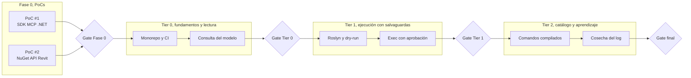
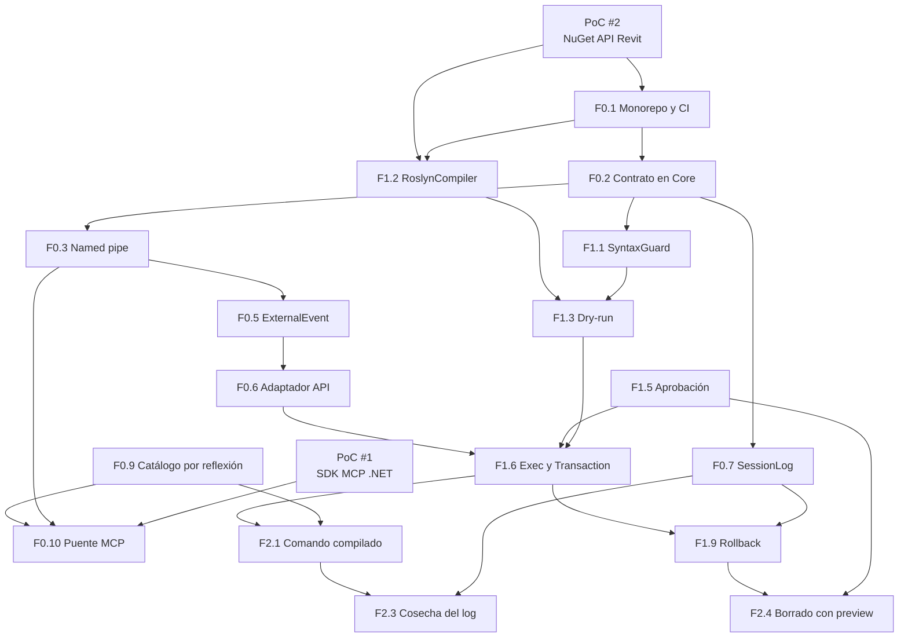

> [!abstract] Metadata
> | | |
> |---|---|
> | **Status** | 🟡 Draft |
> | **Owner** | Usuario único, arquitecto y desarrollador de plugins de Revit |
> | **Created** | 2026-08-17 |
> | **Updated** | 2026-08-17 |
> | **Version** | v0.1 |
> | **Parent specs** | [[product-spec]] · [[tech-spec]] |
> | **Scope** | Fase 0 de 2 PoCs bloqueantes, más tres tiers de features de complejidad creciente hasta el ciclo de graduación cerrado |

## 🔗 Tracking

| Item | Issue |
|---|---|
| PoC #1, SDK oficial de MCP para .NET | — |
| PoC #2, paquete NuGet de metadatos de la API | — |
| Tier 0, fundamentos y lectura | — |
| Tier 1, ejecución con salvaguardas | — |
| Tier 2, catálogo y ciclo de aprendizaje | — |

Los issues no están creados todavía. `/aisy.specify-feature` los detecta y `/aisy.clean-feature` los cierra al alinear las specs, así que conviene abrirlos antes de empezar cada tier.

## 🎯 Vision

Dos PoCs bloquean el arranque porque validan las dos decisiones sobre las que se apoya todo lo demás: que el SDK oficial de MCP para .NET aguanta, y que existe un paquete de metadatos de la API que permite compilar sin Revit instalado. Superados, tres tiers de complejidad creciente llevan de leer el modelo sin tocarlo, a ejecutar código con todas las salvaguardas activas, a cerrar el ciclo donde lo que funciona se acumula. El hito final es una pasarela que se usa a diario y cuyo catálogo crece con el uso real.

## 📊 Overview

## 🧪 Phase 0 — Proof of Concepts

Dos PoCs, **independientes entre sí y paralelizables**. Bloquean el arranque de Tier 0 porque cada uno valida un ADR del que depende la estructura completa del proyecto: si el PoC #1 falla hay que volver a Node y TypeScript, y si falla el PoC #2 no hay CI ni build reproducible. Construir los tiers antes de resolverlos es construir sobre lo no verificado, que es exactamente lo que este roadmap ordena evitar.

Ninguno de los dos lleva estimación: el TechSpec no las incluye y no se inventan aquí.

### PoC #1 — SDK oficial de MCP para .NET `[P]`

- **Issue** — —
- **Hypothesis** — Existe un SDK oficial de MCP para .NET lo bastante maduro para declarar herramientas con esquema tipado y servirlas por stdio, de modo que el proceso puente pueda escribirse en C# en lugar de Node y TypeScript.
- **Functional design** — Un proyecto `net8.0` mínimo que declare dos herramientas, una sin parámetros y otra con parámetros tipados, las sirva por stdio, se registre como servidor MCP en Claude Code y devuelva una respuesta fija. Sin Revit, sin pipes, sin Roslyn: solo el protocolo. *(inferido: el TechSpec pide el PoC pero no describe el experimento)*
- **Setup** — Claude Code con el servidor registrado, y el proyecto publicado como `.exe` autocontenido `win-x64` para comprobar que no exige runtime instalado.
- **Success criteria**
  - Claude Code lista las dos herramientas declaradas, con su esquema visible
  - Invoca la herramienta con parámetros y recibe la respuesta sin error de protocolo
  - El `.exe` autocontenido funciona en una máquina sin .NET 8 instalado
  - Se puede devolver contenido de error dentro de una respuesta correcta, que es lo que exige ADR-007
- **Closing decision** — Resuelve **ADR-001**. Si falla, el puente vuelve a Node y TypeScript y hay que rehacer ADR-004, porque el contrato compartido en `Core` deja de ser código compilado y pasa a ser un esquema duplicado.
- **Output** — Proyecto del PoC en el repo, nombre y versión exacta del paquete anotados en el Tech Stack del [[tech-spec]], y el Discovery correspondiente cerrado.

### PoC #2 — Paquete NuGet de metadatos de la API de Revit `[P]`

- **Issue** — —
- **Hypothesis** — Existe un paquete NuGet de solo metadatos que cubre la API de Revit 2026 completa y permite compilar el addin en una máquina sin Revit instalado, produciendo un DLL que Revit 2026 carga igual que uno compilado contra las DLL locales.
- **Functional design** — Un addin trivial, un `IExternalApplication` que añade un botón al ribbon, compilado dos veces: una contra el paquete NuGet y otra contra las DLL de `C:\Program Files\Autodesk\Revit 2026\`. Comparar que ambos cargan y funcionan. *(inferido)*
- **Setup** — Una máquina con Revit 2026 para la comparación y la carga, y un entorno sin Revit, un runner de CI o un contenedor, para verificar que la compilación no lo necesita.
- **Success criteria**
  - El addin compila en Debug y Release sin Revit instalado
  - El DLL resultante carga en Revit 2026 y el botón funciona
  - Están disponibles los ensamblados que el proyecto necesita, como mínimo `RevitAPI` y `RevitAPIUI`
  - Un workflow de CI compila y pasa los tests sin Revit
- **Closing decision** — Resuelve **ADR-008**. Si falla, se cae a referencia por ruta local, desaparece el CI, y la distribución a terceros exige que quien compile tenga Revit instalado.
- **Output** — Nombre y versión del paquete anotados en Tech Stack y Dependencies del [[tech-spec]], workflow de CI funcionando, y el Discovery correspondiente cerrado.

> [!info] Paralelización
> Los dos PoCs son independientes: tocan stacks distintos, no comparten código y ninguno consume la salida del otro. El #1 no necesita Revit y el #2 no necesita MCP, así que pueden ejecutarse a la vez. El gate de la Fase 0 exige los dos cerrados porque Tier 0 arranca el monorepo con las dos decisiones ya tomadas, y rehacer la estructura después es más caro que esperar.

## 🚀 Tier 0 — Fundamentos y lectura

Levanta el andamiaje completo y **todo lo que no escribe en el modelo**. Al cerrar este tier la pasarela ya es útil: Claude puede consultar el documento abierto, resolver `ElementId` reales y listar el catálogo, que es el paso obligatorio previo a cualquier escritura según la regla de precedencia de `CLAUDE.md`. Nada en este tier abre una `Transaction`, así que el riesgo sobre el modelo es nulo.

| # | Feature | Depends on | Notes |
|---|---|---|---|
| F0.1 | Monorepo, solución y CI: los cinco proyectos del grafo de módulos, `dotnet build` en Debug y Release, workflow que compila y testea | PoC #2 | El CI depende del paquete de metadatos |
| F0.2 | Contrato de mensajes en `RevitBridge.Core`: tipos de petición y respuesta, enum de fase, descriptor de comando, interfaces de la costura | F0.1 | Sin referencias a Revit ni a Windows, por ADR-004 |
| F0.3 | Transporte por named pipe: servidor en el addin, cliente en el puente, ACL de usuario, bloqueo con `TaskCompletionSource` y timeout | F0.2 | ADR-002. Incluye el cliente de línea de comandos que sustituye a curl |
| F0.4 | Addin mínimo: `IExternalApplication`, arranque del `PipeServer` en su propio hilo, registro del `.addin` | F0.3, PoC #2 | El listener no toca la API en ningún caso |
| F0.5 | Cola de ejecución vía `ExternalEvent`: encolar, esperar a Revit ocioso, devolver el resultado real al pipe | F0.4 | Nunca responder aceptado en vacío |
| F0.6 | Adaptador `RevitContext`: implementación contra la API de las interfaces de `Core` | F0.2, F0.5 | La única capa sin test automático, y por eso la más fina posible |
| F0.7 | Registro `SessionLog`: línea JSONL antes de ejecutar, completada después, con tipo de excepción e `InnerException` | F0.2 | ADR-006. Es la única verdad de los ids creados |
| F0.8 | Operación de consulta del modelo: niveles, tipos, símbolos, parámetros, selección, mediciones | F0.6, F0.7 | Sin transacción, aprobación automática |
| F0.9 | Catálogo de comandos: atributo marcador en `RevitBridge.Utils` y descubrimiento por reflexión al arrancar | F0.4 | ADR-005. Nombres duplicados deben fallar al arrancar, no en silencio |
| F0.10 | Puente MCP con las herramientas de lectura declaradas y la propagación de errores de ADR-007 | F0.3, F0.8, F0.9, PoC #1 | Herramientas individuales tipadas, no una genérica |
| F0.11 | Healthcheck de dos niveles: conexión al pipe con catálogo, y consulta trivial que atraviesa el `ExternalEvent` | F0.8, F0.10 | Nivel 1 verde con nivel 2 caducado no es un fallo |

**Criterio de cierre de Tier 0** — Existe un test E2E automatizado que arranca el puente MCP real contra un `PipeServer` con ejecutor falso, invoca la herramienta de consulta y la de catálogo, y verifica la respuesta y el camino de error, todo sin Revit y en verde en CI.

## 🚀 Tier 1 — Ejecución con salvaguardas

Añade la capacidad de **escribir en el modelo**, y no añade ni una operación de escritura antes de que su salvaguarda esté en pie. El orden de las features de este tier es deliberado: el filtro sintáctico y el dry-run existen antes que el ejecutor, y la ventana de aprobación existe antes de la primera `Transaction`. Al cerrar el tier funcionan las cinco capas de §5 de `DOCUMENTACION.md`.

| # | Feature | Depends on | Notes |
|---|---|---|---|
| F1.1 | Filtro sintáctico `SyntaxGuard`: rechazo por `CSharpSyntaxWalker` antes de compilar, con `doc.Delete` bloqueado hasta que exista su vía dedicada en F2.4 | F0.2 | §5.A.3. También cubre alias y reflexión que intenten rodearlo |
| F1.2 | `RoslynCompiler`: `CSharpCompilation`, juego de referencias resuelto por reflexión sobre el AppDomain, `AssemblyLoadContext` colectible, caché por hash del snippet | F0.1, PoC #2 | ADR-003. El juego de referencias es el punto pejiguero conocido; la caché se toma de Westwind aunque el paquete se descarte |
| F1.3 | Operación de dry-run: `Emit` sin ejecutar, devolución de diagnósticos, sin abrir transacción | F1.1, F1.2 | Un fallo aquí cuesta un segundo; el mismo en runtime cuesta mucho más |
| F1.4 | `RevitBridge.Utils` referenciado en cada compilación, para que el código generado invoque lo ya probado | F1.2, F0.9 | §8. Evita re-derivar y repetir errores ya resueltos |
| F1.5 | Ventana de aprobación WPF modeless: snippet formateado, aprobar y rechazar, y rechazo automático al caducar | F0.5 | ADR-009. Es la salvaguarda más importante del diseño |
| F1.6 | Operación de ejecución: `Transaction` con nombre `Claude: intención`, o `TransactionGroup` con `Assimilate` y `RollBack` si es multipaso | F1.3, F1.5, F0.6 | Ámbito por defecto limitado a lo creado en la sesión |
| F1.7 | `IFailuresPreprocessor` que traga warnings del commit pero no errores | F1.6 | Los errores revierten, no se auto-resuelven |
| F1.8 | Herramienta MCP única de ejecución de C#, descrita como escotilla de emergencia | F1.6, F0.10 | El sesgo hacia el catálogo se diseña en cómo se expone, por §3 |
| F1.9 | Operación de rollback: reconstruir los ids de la sesión leyendo el JSONL, con previsualización y confirmación | F1.6, F0.7 | ADR-006. Debe tolerar un log truncado por caída |

**Criterio de cierre de Tier 1** — Existe un test E2E automatizado que cubre el camino completo con ejecutor falso: dry-run con diagnósticos, snippet rechazado por el filtro sintáctico, aprobación concedida que ejecuta, aprobación caducada que no ejecuta, fallo de runtime que devuelve traza con `fase` correcta, y rollback que borra lo registrado. Todo sin Revit y verde en CI.

## 🚀 Tier 2 — Catálogo y ciclo de aprendizaje

Cierra el bucle de §6: lo que se usa y se demuestra estable deja de improvisarse. Este tier es el que hace que el sistema mejore con el uso en vez de quedarse igual, y el que baja progresivamente la proporción de ejecuciones que necesitan Roslyn.

| # | Feature | Depends on | Notes |
|---|---|---|---|
| F2.1 | Operación de invocación de comando compilado, con argumentos tipados según el esquema | F0.9, F1.6 | Nombres idénticos entre puente y addin, o el modelo no los encuentra |
| F2.2 | Commandset inicial de consulta: información de la vista actual, elementos de la vista, tipos de familia disponibles, selección, mediciones, filtro de elementos | F2.1 | Derivado de la lista de §7. Cubre casi todo el uso de lectura |
| F2.3 | Cosecha del log: análisis del JSONL que propone candidatos a graduar con su evidencia, y errores recurrentes destilados | F0.7, F2.1 | La skill `/harvest-bridge-log` ya define el procedimiento |
| F2.4 | Vía dedicada de borrado: previsualización de cuántos elementos y de qué categorías, y confirmación manual obligatoria | F1.5, F1.9 | §5.C.9. Desbloquea `doc.Delete` en el filtro de F1.1 |
| F2.5 | Protección de elementos preexistentes: ámbito de sesión por defecto y aprobación manual siempre para modificar lo que ya estaba | F1.6 | §5.C.10. Sin excepción, ni con confianza temporal |

**Criterio de cierre de Tier 2** — Existe un test E2E automatizado que invoca un comando compilado del catálogo a través del puente, verifica que el nombre coincide entre ambos lados, y cubre la vía de borrado con previsualización y la protección de preexistentes. Además, la cosecha del log produce un informe sobre un JSONL de prueba con candidatos y descartes justificados.

## 🔗 Dependency Graph

Las dependencias no obvias que conviene retener: el CI depende del PoC #2 y no solo del monorepo; el puente MCP depende del PoC #1 y del catálogo, porque las herramientas que declara salen del descubrimiento por reflexión; el rollback depende del `SessionLog` y no del ejecutor, porque su fuente de verdad es el JSONL; y la vía de borrado depende de la aprobación y del rollback, no del ejecutor directamente.

## ✅ Gates

### Gate Fase 0

Todas simultáneamente:

- **Peldaño 1 (SDK oficial)**: PoC #1 cerrado con sus cuatro criterios cumplidos (SC-001/002/003 verificados por usuario; criterio 4 = publicación y arranque en máquina de dev; criterio de "autocontenido sin .NET" aplazado a PoC de distribución final), O
- **Peldaño 2 (implementación propia en C#)**: PoC #1 cerrado con sus tres criterios de protocolo (SC-001/002/003), servidor compila en Release, pero el SDK no cubre capacidades requeridas (preview o sin typed schemas), O
- **Revertida a Node**: ADR-001 revertido a Node y TypeScript, ADR-004 rehecho, si ninguno de los dos peldaños C# es viable
- PoC #2 cerrado, o ADR-008 revertido a referencia por ruta local (si PoC #2 no encuentra paquete NuGet de metadatos)
- Nombre y versión exactos de los paquetes usados anotados en el Tech Stack y en Dependencies del [[tech-spec]], sustituyendo los *TBD*
- Los dos Discovery bloqueantes del [[tech-spec]] marcados como resueltos

### Gate Tier 0 → Tier 1

- Test E2E de lectura en verde en CI, sin Revit
- `dotnet build` limpio en Debug y Release
- Confirmado en Revit 2026 vivo, por el usuario y no por un agente, que el addin carga y que una consulta devuelve datos reales del documento abierto
- Ninguna operación del tier abre una `Transaction`, verificable por inspección

### Gate Tier 1 → Tier 2

- Test E2E de ejecución en verde en CI, con los seis caminos del criterio de cierre cubiertos
- Las cinco capas de salvaguardas de §5 presentes y con test la que se pueda testear sin Revit
- Confirmado en Revit vivo que una ejecución aprobada crea geometría, que aparece como una sola entrada en el historial de deshacer con el nombre `Claude: intención`, y que el rollback la elimina
- El `AssemblyLoadContext` descarga tras una ejecución, medido y no supuesto

### Gate final

- Los tres tiers cerrados con sus gates
- La pasarela se usa a diario sobre trabajo real y el JSONL acumula ejecuciones de este entorno
- Al menos un snippet graduado a comando compilado por el procedimiento de F2.3, no a mano
- La proporción de ejecuciones que necesitan Roslyn frente a comando compilado desciende entre dos cosechas consecutivas, que es la señal de que el catálogo madura
- Ninguna decisión empotrada impide empaquetar: sin rutas fijas, sin credenciales, config con defaults, por ADR-010

## 🚫 Out of Roadmap

**Descartado por diseño**

- **Bridge de Python** — Un bridge de Python ya es el equivalente a Roslyn: no aporta nada que Roslyn no dé y duplica runtime
- **Escritura en disco desde la pasarela** — Guarda el usuario, siempre. Es la decisión, no una limitación pendiente
- **Multi-documento y documentos de familia** — Multiplica el daño posible sin aportar al caso de uso
- **Acceso desde red** — El transporte es un named pipe local con ACL de usuario. No hay puerto que exponer, por ADR-002
- **Timeout real de ejecución** — Técnicamente imposible con Revit monohilo. Se mitiga con cota de iteraciones, dry-run y revisión humana

**Diferido a futuro**

- **Instalador y empaquetado** — Fuera de la v1 por ADR-010. El núcleo es lo único que todavía puede fracasar
- **Confiar durante 30 minutos** — Descartado a propósito para la v1: mientras el sistema no se demuestre, la revisión humana no debe tener agujeros
- **Rollback de modificaciones** — Exige capturar el valor anterior de cada parámetro. Discovery abierto en ambas specs
- **Distribución al estudio** — Cambiaría la salvaguarda principal, que asume un usuario capaz de juzgar el snippet que aprueba
- **Soporte de Revit 2027** — Cuando exista y el núcleo esté estable
- **Graduación automática de snippets** — F2.3 propone candidatos; aprobarlos y convertirlos pasa por el flujo normal de desarrollo

**Cubierto por otro documento**

- **Contrato de la pasarela y salvaguardas** — `DOCUMENTACION.md` §4 y §5 son la autoridad; este roadmap solo ordena su construcción
- **Procedimiento de uso diario** — La skill `/revit-bridge` del proyecto
