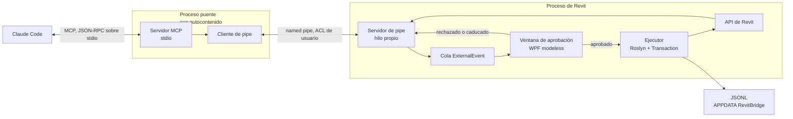
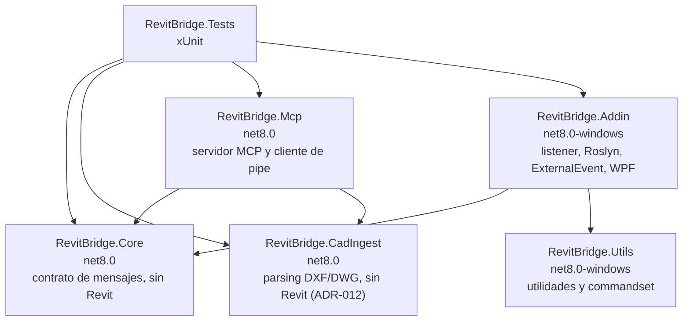
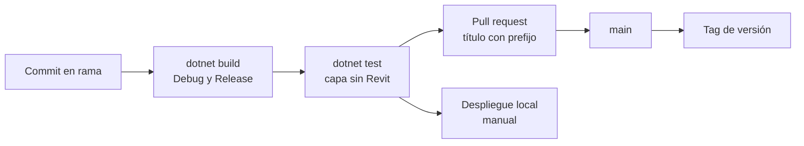

> [!abstract] Metadata
> | | |
> |---|---|
> | **Status** | 🟡 Draft |
> | **Owner** | Usuario único, arquitecto y desarrollador de plugins de Revit |
> | **Created** | 2026-08-17 |
> | **Updated** | 2026-08-18 |
> | **Version** | v0.1 |
> | **ProductSpec** | [[product-spec]] |

## 📌 Scope

Este documento cubre el cómo técnico de la pasarela PROMPT_TO_REVIT: el proceso puente que habla MCP con Claude, el addin que ejecuta dentro de Revit 2026, la biblioteca de utilidades y comandos, y el transporte entre ambos procesos. El qué y el por qué están en [[product-spec]]; las fases y dependencias en [[roadmap]].

Tres decisiones de este TechSpec se desvían deliberadamente de `DOCUMENTACION.md`, que sigue siendo la autoridad de diseño en todo lo demás: el lenguaje del servidor MCP (§2), el transporte entre procesos (§2, §4, §E.18) y el descarte de `Westwind.Scripting` (§7). Ver ADR-001, ADR-002 y ADR-003.

Fuera del alcance de este documento: el empaquetado e instalador, el soporte de versiones de Revit distintas de 2026, y cualquier transporte accesible desde red.

## 🧱 Tech Stack

| Component | Technology | Version | Rationale |
|---|---|---|---|
| Lenguaje | C# | 12 (incluido en .NET 8) | Un solo lenguaje en todo el proyecto, el que ya domina el autor. Ver ADR-001 |
| Runtime del addin | .NET | 8, target `net8.0-windows` | Impuesto por Revit 2026, que corre sobre .NET 8. No es una elección |
| Runtime del puente | .NET | 8, target `net8.0` | Sin dependencia de Windows Forms ni WPF: el puente no tiene UI |
| Host | Autodesk Revit | 2026, interfaz en inglés | Único target soportado |
| Protocolo con Claude | `ModelContextProtocol` (SDK oficial de MCP para .NET) | 2.2.0 | Resuelve el JSON-RPC sobre stdio, el handshake y la declaración de herramientas con esquema tipado. Confirmado por PoC #1, ver ADR-001 |
| Compilación dinámica | `Microsoft.CodeAnalysis.CSharp` | *TBD* | Roslyn directo, sin envoltorio. Control explícito del juego de referencias, del `Emit` sin ejecutar y del `AssemblyLoadContext` colectible. Ver ADR-003 |
| Referencias de la API | `Nice3point.Revit.Api.RevitAPI` + `Nice3point.Revit.Api.RevitAPIUI` | `2026.4.10`, fija (`Version="[2026.4.10]"`, sin rango flotante) | `RevitAPI.dll` no es redistribuible. Referencia de solo compilación (`ref/` sin `lib/`): compila y hace CI sin Revit instalado. Confirmado por PoC #2, ver ADR-008 |
| Transporte entre procesos | `System.IO.Pipes`, named pipes | incluido en .NET 8 | Sin puerto abierto, sin token, ACL de usuario del sistema. Ver ADR-002 |
| UI de aprobación | WPF | incluida en `net8.0-windows` | Ventana modeless dentro del proceso de Revit |
| Serialización | `System.Text.Json` | incluido en .NET 8 | Contrato de mensajes y registro JSONL. Sin dependencia externa |
| Testing | xUnit | *TBD* | Capa sin Revit, ver Testing Strategy |

> [!tip] Dependencias directas
> SDK de MCP para .NET, `Microsoft.CodeAnalysis.CSharp`, y los dos paquetes de metadatos de la API de Revit (`Nice3point.Revit.Api.RevitAPI` y `Nice3point.Revit.Api.RevitAPIUI`). Todo lo demás viene con .NET 8.
>
> Matiz sobre los paquetes de la API: son dependencias de **compilación**, no de runtime. Van en `ref/` sin `lib/`, no aportan activo de runtime y no se copian a la carpeta de salida — verificado por observación en el PoC #2, no supuesto. En Revit, esos ensamblados los provee el propio proceso anfitrión.

## 🏗️ Module Design

Topología de procesos:



Grafo de módulos y dependencias de compilación:



`Core` es la pieza que hace posible el resto: al no referenciar la API de Revit ni Windows, el contrato de mensajes se comparte entre los dos procesos y se testea sin Revit. Cualquier cambio del contrato rompe la compilación de ambos lados en el mismo commit, que es exactamente la garantía que se busca con el monorepo.

#### `src/RevitBridge.Core` — Contrato compartido

Define los tipos de petición y respuesta, el enum de fase, el descriptor de comando y las interfaces de la costura de abstracción, sin referenciar la API de Revit ni ningún tipo de Windows.

#### `src/RevitBridge.Mcp` — Puente MCP

Publica las operaciones de la pasarela como herramientas MCP sobre stdio y las reenvía al addin por el named pipe, sin interpretar ni resumir nada de lo que pasa por él.

#### `src/RevitBridge.Addin/Bridge/PipeServer` — Escucha

Atiende el named pipe en su propio hilo, autentica por ACL, deserializa la petición y bloquea con `TaskCompletionSource` hasta que el ejecutor devuelve el resultado real.

#### `src/RevitBridge.Addin/Bridge/SyntaxGuard` — Filtro sintáctico

Recorre el árbol sintáctico con un `CSharpSyntaxWalker` antes de compilar y rechaza el snippet si aparece cualquier API prohibida por §5.A.3, sin llegar a emitir ensamblado.

#### `src/RevitBridge.Addin/Bridge/RoslynCompiler` — Compilación en memoria

Construye el `CSharpCompilation` con el juego de referencias resuelto, emite a memoria dentro de un `AssemblyLoadContext` colectible con caché por hash del snippet, y soporta el modo `Emit` sin ejecutar que exige el dry-run.

#### `src/RevitBridge.Addin/Bridge/ExecutionQueue` — Puente al contexto de la API

Encola la petición y la ejecuta vía `ExternalEvent` cuando Revit queda ocioso, envolviendo cada operación en una `Transaction` con nombre o un `TransactionGroup` si es multipaso.

#### `src/RevitBridge.Addin/Bridge/SessionLog` — Registro

Escribe la línea JSONL antes de ejecutar y la completa con el resultado, siendo la única fuente de verdad de los ids creados en la sesión.

#### `src/RevitBridge.Addin/Adapters/RevitContext` — Costura de abstracción

Implementa contra la API de Revit las interfaces declaradas en `Core`, concentrando en la capa más fina posible todo el código que no se puede testear sin Revit abierto.

#### `src/RevitBridge.Addin/UI/ApprovalWindow` — Revisión humana

Muestra el snippet formateado y espera decisión, devolviendo rechazo automático si caduca el plazo sin intervención.

#### `src/RevitBridge.CadIngest` — Ingesta CAD (ADR-012)

Lee DXF/DWG con `ACadSharp` (mismo modelo `CadDocument` para los dos formatos), resume capas, calibra escala por cabecera y extrae geometría de una capa a segmentos rectos en metros (teselando arcos por bisección de bulge, ≤12° de barrido por defecto), en el mismo esquema JSON que ya aceptan `CrearMuroRecto`/`CrearMurosMasivo`. Sin Revit ni Windows — vive en el proceso del puente, no en el addin, por el mismo principio de superficie mínima de dependencia que ADR-003. Envuelto por herramientas MCP (`RevitBridge.Mcp/Tools/CadIngestTools.cs`) que no pasan por el named pipe: operan sobre un fichero local dentro del propio proceso del puente.

#### `src/RevitBridge.Utils` — Utilidades y commandset

Aloja el código de modelado ya probado, con los comandos del catálogo marcados por atributo para su descubrimiento por reflexión, y se referencia en cada compilación Roslyn para que el código generado invoque lo probado en vez de re-derivarlo.

## 🔄 Integration Mapping

| Internal operation | Method | External service | Notes |
|---|---|---|---|
| Declaración y llamada de herramientas | JSON-RPC sobre stdio | Claude Code, vía SDK de MCP | Los comandos compilados se publican como herramientas individuales tipadas; la ejecución de C# como una sola herramienta marcada como escotilla de emergencia |
| Envío de petición al addin | Named pipe, mensaje JSON | Proceso de Revit | Nombre del pipe derivado del usuario y la sesión. ACL restringida al usuario actual |
| Lectura y escritura del modelo | Llamada in-process | API de Revit | Solo desde el hilo de la API, siempre vía `ExternalEvent` |
| Resolución de referencias de compilación | Reflexión sobre ensamblados cargados | AppDomain del proceso de Revit | Filtrar los no dinámicos con `Location` no vacía y añadir explícitamente los ensamblados de la API y `RevitBridge.Utils` |
| Registro de ejecuciones | Append a fichero | Sistema de ficheros, `%APPDATA%\RevitBridge\log\` | Escritura antes de ejecutar, ver Logging |

> [!warning] Comportamientos no obvios
> El puente MCP arranca como subproceso de Claude Code y puede estar vivo con Revit cerrado: la ausencia del pipe es el caso normal, no un error del sistema. En sentido inverso, el addin puede estar cargado y aun así no ejecutar nada durante minutos si el usuario tiene un comando o un diálogo abierto, porque `ExternalEvent` difiere en vez de interrumpir. Ninguno de los dos casos debe reportarse como fallo del bridge.
>
> El `AssemblyLoadContext` colectible no descarga si el snippet deja una referencia viva. Es fuga de memoria, no fallo de corrección, y no se manifiesta hasta acumular muchas ejecuciones en una sesión larga.

## ⚠️ Error Handling

### Errores esperados

| Source | Error | Action | Description |
|---|---|---|---|
| `SyntaxGuard` | API prohibida en el snippet | Rechazar sin compilar | `fase: compilacion`. No se emite ensamblado ni se abre transacción |
| Roslyn | Diagnósticos de compilación | Devolver diagnósticos | `fase: compilacion`. Casi siempre una API rota por versión, ver §7 de `DOCUMENTACION.md` |
| Ventana de aprobación | Rechazo del usuario | No ejecutar | Respuesta explícita de rechazo, sin transacción |
| Ventana de aprobación | Plazo agotado sin intervención | Rechazo automático | Ver ADR-009. El caso por defecto es no tocar el modelo |
| API de Revit | Excepción en runtime | `RollBack` y devolver traza | `fase: runtime`. Casi siempre un supuesto falso sobre el documento; se corrige consultando, no reintentando |
| API de Revit | Excepción con `Message` vacío | Registrar tipo e `InnerException` | Frecuente en la API de Revit. Sin este respaldo el log no dice nada útil |
| `IFailuresPreprocessor` | Warnings en el commit | Tragar warnings | Los warnings bloquearían el commit con un diálogo. Los errores no se auto-resuelven: revierten |
| Pipe | Revit cerrado o addin no cargado | Error de protocolo MCP | No es un fallo de ejecución: es que no hay a quién preguntar |
| Pipe | Timeout de la petición | Error de protocolo MCP | La ejecución en Revit no se cancela: no hay timeout real, ver Known Limitations |

### Propagación

Un fallo de ejecución viaja como **respuesta MCP correcta** cuyo contenido es el JSON de §4 con `ok`, `fase`, `resultado`, `ids_creados`, `error`, `traza` y `duracion_ms`. Así se garantiza que Claude reciba la traza íntegra y pueda triar por fase, en vez de arriesgar que el cliente resuma o recorte un error de protocolo. Ver ADR-007.

El error de protocolo MCP se reserva para lo que no es un fallo de ejecución: Revit cerrado, pipe caído, timeout del transporte. El puente propaga el contenido tal cual, sin resumirlo ni reinterpretarlo.

## 🩺 Healthcheck

Dos niveles, porque comprueban cosas distintas y su combinación es diagnóstica:

- **Nivel 1, addin vivo**: el cliente conecta al named pipe y pide el catálogo de comandos. Confirma que Revit está abierto, el addin cargado y el hilo del listener escuchando. No confirma que se pueda ejecutar nada.
- **Nivel 2, ida y vuelta completa**: una consulta trivial, el nombre del documento activo, que atraviesa el `ExternalEvent`. Es el único healthcheck real.

Nivel 1 en verde y nivel 2 agotando el plazo significa que Revit está ocupado o con un diálogo abierto. No es un fallo: es el principio de diferir sin interrumpir funcionando como se diseñó, y así debe reportarse.

## 📋 Logging

`System.Text.Json` sobre un `StreamWriter` en modo append, una línea JSON por ejecución en `%APPDATA%\RevitBridge\log\YYYY-MM.jsonl`. Sin librería de logging: el formato es el contrato del corpus de §6, no texto para leer.

| Event | Level | Fields |
|---|---|---|
| Petición recibida, antes de ejecutar | info | `ts`, `intencion`, `via`, `fuente`, `sesion` |
| Ejecución completada | info | `fase: ok`, `resultado`, `ids_creados`, `duracion_ms` |
| Fallo de compilación | warn | `fase: compilacion`, `error`, diagnósticos |
| Fallo de runtime | error | `fase: runtime`, `error`, `traza`, tipo de excepción, `InnerException` |
| Rechazo, manual o por caducidad | info | `intencion`, motivo del rechazo |
| Rollback | info | ids borrados, ids que no se pudieron borrar |

Dos reglas estructurales, no preferencias de estilo:

- **La línea se escribe antes de ejecutar** y se completa después. Si Revit cae, queda la evidencia de qué lo tumbó, que es precisamente el caso en el que un log escrito al final no existe.
- **El registro es la única verdad de los ids creados.** `/rollback` los reconstruye leyendo el JSONL de la sesión, así que sobrevive a una caída de Revit. Ver ADR-006.

## 🧪 Testing Strategy

### Unit Tests

| Module | What is tested | Mock/stub |
|---|---|---|
| `Core` | Serialización del contrato, ida y vuelta de cada tipo de mensaje, enum de fase | ninguno |
| `SyntaxGuard` | Cada API prohibida se rechaza; código de modelado legítimo pasa; ofuscación por alias o reflexión | ninguno, es análisis sintáctico puro |
| `RoslynCompiler` | `Emit` sin ejecutar devuelve diagnósticos; el juego de referencias se construye; el ALC descarga | referencias de la API por paquete de metadatos, sin Revit |
| `SessionLog` | Escritura antes de ejecutar, formato JSONL, reconstrucción de ids de sesión, ficheros corruptos o truncados | sistema de ficheros temporal |
| `RevitBridge.Mcp` | Declaración de herramientas, propagación íntegra del contenido de error, mapeo de fallos de transporte | servidor de pipe falso |
| `PipeServer` | Serialización, ACL, bloqueo hasta resultado, comportamiento ante cliente desconectado | ejecutor falso que implementa la interfaz de `Core` |
| Descubrimiento de comandos | Los tipos marcados por atributo se descubren; nombres duplicados fallan al arrancar | ensamblado de prueba |

### Integration Tests

Prerrequisitos: sin Revit. Se levanta el `PipeServer` con un ejecutor falso y el puente MCP real contra él, y se verifica el flujo completo desde la llamada a la herramienta hasta la respuesta, incluyendo el camino de error y el de rechazo por caducidad.

Lo que **no** se cubre automáticamente es el adaptador que toca la API de Revit. Es deliberado: esa capa se mantiene lo más fina posible precisamente porque es la única sin red de seguridad, y su verificación es manual en Revit vivo, confirmada por el usuario y nunca por un agente.

### Tools

xUnit, versión *TBD*. Sin objetivo numérico de cobertura: el criterio es que toda la lógica fuera del adaptador de la API tenga test, y que el adaptador no contenga lógica que merezca uno. Verificación mínima para cerrar cualquier tarea: `dotnet build` limpio en Debug y en Release.

**Lección del PoC #1** (`pocs/001-poc-1-sdk-oficial-de-mcp-para-net/VEREDICTO.md`): de seis tareas de
código del Lote 2, cuatro tenían un defecto que solo se veía ejecutando, y las cuatro eran el mismo
patrón — algo correcto que parecía roto (un marcador de traza escapado por `System.Text.Json`, un
recuento que dependía de un `Dispose()` que nunca se ejecutaba, un arranque en frío indistinguible de un
servidor muerto, un guion de verificación que afirmaba algo que el propio log contradecía). Sin
corregirlos, el veredicto habría sido negativo sobre una premisa falsa. **Principio operativo para
Tier 0 en adelante: quien escribe el código no puede ser quien lo verifica** — de ahí que `tester` y
`judge` sean agentes separados de quien implementa, y que las verificaciones en Revit vivo las confirme
siempre el usuario. Además, un fallo del SDK, un fallo de registro del servidor en Claude Code y un
fallo del propio código se manifiestan **idénticos desde fuera** ("la herramienta no aparece"); el
procedimiento de triaje en tres pasos que los distingue (arranca el ejecutable a mano → confirma el
registro con `claude mcp get`/`list` → aísla con `claude --debug=mcp`) está documentado en
`pocs/001-poc-1-sdk-oficial-de-mcp-para-net/GUION-VERIFICACION.md` §5 y se reutiliza tal cual la
primera vez que aparezca el mismo síntoma en Tier 0.

## 🔌 Deployment



CI viable porque las referencias de la API vienen por NuGet: el runner compila y testea sin Revit instalado. Lo que el CI no puede hacer es ejecutar nada contra Revit, y no se debe simular que sí.

Build:

```
dotnet build src/RevitBridge.sln -c Release
dotnet test tests/RevitBridge.Tests -c Release
dotnet publish src/RevitBridge.Mcp -c Release -r win-x64 --self-contained
```

### Variables de entorno

No hay variables de entorno obligatorias. La configuración vive en `%APPDATA%\RevitBridge\config.json`, con valores por defecto para todo y generación automática de lo que falte.

| Variable | Purpose |
|---|---|
| `REVITBRIDGE_CONFIG` | Ruta alternativa al fichero de configuración. Opcional, para pruebas |
| `REVITBRIDGE_PIPE` | Nombre del pipe. Opcional, útil si conviven dos instancias |

### Desarrollo local

Compilar con **Revit cerrado**: el DLL del addin queda bloqueado mientras Revit está abierto. Después, registrar el addin en `%APPDATA%\Autodesk\Revit\Addins\2026\RevitBridge.addin`, con el `FullClassName` coincidiendo exactamente con `namespace.ClassName`, y declarar el `.exe` publicado del puente como servidor MCP en Claude Code.

La capa sin Revit se desarrolla y testea con Revit cerrado y sin registrar nada, que es el modo de trabajo normal.

## 📦 Dependencies

Runtime:

```
ModelContextProtocol                2.2.0
Microsoft.Extensions.Hosting        8.0.0
Microsoft.CodeAnalysis.CSharp       TBD
Nice3point.Revit.Api.RevitAPI       [2026.4.10]   solo compilación (ref/), no se copia a la salida
Nice3point.Revit.Api.RevitAPIUI     [2026.4.10]   solo compilación (ref/), no se copia a la salida
ACadSharp                           [3.0.0]        MIT, DXF y DWG con la misma API. Ver ADR-012
```

Dev:

```
xUnit                               TBD
```

`ModelContextProtocol` y `Microsoft.Extensions.Hosting` quedan fijadas por el PoC #1 (ver
`pocs/001-poc-1-sdk-oficial-de-mcp-para-net/DECISION-PELDANO.md` §4 y `VEREDICTO.md`); el `.csproj` de
`RevitBridge.Mcp` debe fijar exactamente esas versiones, sin rango flotante. Los dos paquetes de la API
de Revit quedan fijados por el PoC #2 (ver `pocs/002-poc-2-paquete-nuget-metadatos-api-revit/RECONOCIMIENTO.md`
§10 y `VEREDICTO.md`), con la **notación de corchetes obligatoria**: `Version="[2026.4.10]"` fija esa
única versión, mientras que `Version="2026.4.10"` significa «≥» y puede resolver hacia arriba. Se rechaza
el rango flotante `$(RevitVersion).*` que recomienda el README del propio paquete. El resto no está
fijado porque no existe todavía ningún `.csproj`: se rellenan al crear los manifiestos y nunca antes.

## 📐 ADRs

### ADR-001: C# en todo el proyecto, Node y TypeScript descartados — CONFIRMADO por PoC #1

**Decisión**: el proceso puente que habla MCP se escribe en C# sobre .NET 8 con el paquete
`ModelContextProtocol` **2.2.0** (SDK oficial de MCP para .NET), no en Node con TypeScript.

**Context**: `DOCUMENTACION.md` §2 fijaba Node/TypeScript, que es donde está el ecosistema de ejemplos y donde antes llegan las novedades del protocolo. Se consideró también implementar el protocolo a mano sin SDK. El autor domina C# y no Node, y la herramienta se quiere distribuible: exigir Node instalado en cada máquina destino es fricción real. Poner MCP en C# no elimina el segundo proceso, solo el segundo lenguaje, porque Claude Code arranca los servidores MCP como subproceso por stdio y el addin vive dentro de Revit.

**Verificado por PoC #1** (`pocs/001-poc-1-sdk-oficial-de-mcp-para-net/VEREDICTO.md`, 2026-08-17):
**peldaño 1 de la escalera de 3** (SDK estable y completo). `ModelContextProtocol` 2.2.0 es estable
(línea estable desde `1.0.0`, 2026-02-25) y cubre stdio + declaración de herramientas con esquema
tipado. Confirmado empíricamente en una sesión real de Claude Code: las herramientas aparecen con su
esquema (SC-001), los tres casos de invocación funcionan sin error de protocolo, incluido el rechazo
diagnosticable de un parámetro que viola el esquema (SC-002), y una traza multilínea dentro de una
respuesta correcta llega íntegra, verificada por sus dos marcadores (SC-003). El ejecutable
autocontenido `win-x64` publica y arranca en la máquina de desarrollo. La escalera de 3 peldaños de
`specs/001-poc-1-sdk-oficial-de-mcp-para-net/plan.md` sustituye al "suspenso = Node" original de este
ADR: solo se cae a Node si **ni el SDK ni una implementación propia** logran que Claude Code hable con
el servidor, y ese no fue el caso.

**Consequences**:
- (+) Un solo lenguaje, un solo `dotnet build`, un solo conjunto de convenciones
- (+) El puente se publica como `.exe` autocontenido: quien lo instale no necesita Node
- (+) El contrato de mensajes se comparte como código compilado en `Core`, no como esquema duplicado
- (-) Menos ejemplos y menos recorrido que el SDK de TypeScript
- (+) ~~Riesgo de madurez del SDK de .NET, sin verificar todavía~~ Verificado por PoC #1: SDK maduro, estable desde hace ~6 meses en la fecha del PoC
- La instrumentación del PoC reveló un hallazgo que no cambia el veredicto pero sí una expectativa: Claude Code invoca, además de `initialize`/`tools/list`/`tools/call` (estándar), los métodos `server/discover` y `subscriptions/listen`, que no están en ninguna especificación pública. Si algún día se activara el peldaño 2 (implementación propia), habría que soportarlos también. Ver `VEREDICTO.md` §3

### ADR-002: Named pipes en lugar de HTTP en loopback

**Decisión**: el transporte entre el puente y el addin es un named pipe con ACL restringida al usuario actual, no `HttpListener` sobre `127.0.0.1` con token en cabecera.

**Context**: el HTTP de §2 y §4 existía para cruzar la frontera entre Node y C#. Con los dos lados en .NET desaparece esa razón. §E.18 advierte de que esto es ejecución de código arbitrario y que expuesto en red es una puerta trasera; un named pipe elimina ese riesgo de raíz en vez de mitigarlo, porque no hay puerto que escuchar ni token que gestionar o filtrar.

**Consequences**:
- (+) Sin superficie de red, sin puerto, sin token, sin secreto que rotar
- (+) La autorización la hace el sistema operativo por ACL de usuario, no código propio
- (+) Nativo en .NET, sin dependencias nuevas
- (-) Se pierde poder depurar con curl o Postman sin el puente delante
- (-) Solo Windows, que aquí es irrelevante: Revit es Windows
- Mitigación de la depuración: un cliente de pipe de línea de comandos en el proyecto de tests cubre el mismo hueco

### ADR-003: Roslyn directo, `Westwind.Scripting` descartado

**Decisión**: usar `Microsoft.CodeAnalysis.CSharp` directamente, sin envoltorio.

**Context**: `Westwind.Scripting`, evaluado el 17-ago-2026, aporta cosas reales: `AddDefaultReferencesAndNamespaces()` resuelve el juego de referencias, cachea ensamblados por código idéntico, formatea errores con número de línea, soporta `AlternateAssemblyLoadContext` y va sobre .NET 8 desde v2.0. Los 10 MB de `Microsoft.CodeAnalysis` se arrastran en ambos casos porque es la misma dependencia, así que la decisión real es solo envoltorio contra directo, y el envoltorio ahorra unas 200 líneas.

Lo que decide es un riesgo específico de Revit: **todos los addins comparten AppDomain**. Si otro addin carga otra versión de `Microsoft.CodeAnalysis`, hay conflicto, y no es prevenible desde aquí. A menos superficie de dependencia, menos riesgo. Se suma que el envoltorio esconde exactamente las tres piezas que hay que afinar, el `Emit` sin ejecutar, el juego de referencias contra los ensamblados de Revit y el ALC colectible, y que el resto de su API (plantillas Handlebars, `Evaluate()` de expresiones, async) es funcionalidad que aquí no se quiere.

**Consequences**:
- (+) Menos superficie de dependencia en un AppDomain que no controlamos
- (+) Control explícito de las tres piezas que este diseño necesita afinar
- (-) Más código propio, y el juego de referencias es el punto pejiguero conocido
- Mitigación: se lee el código de Westwind como referencia para la resolución de referencias y para la **caché de ensamblados por hash del snippet**, que se adopta aunque el paquete se descarte

### ADR-004: Monorepo con el contrato compartido en un proyecto sin Revit

**Decisión**: un solo repositorio; `RevitBridge.Core` con el contrato de mensajes, sin referenciar la API de Revit ni Windows, referenciado por el puente, el addin y los tests.

**Context**: los nombres de comando y el formato de respuesta deben coincidir exactamente entre los dos procesos, y un desajuste no produce error diagnosticable: el modelo simplemente no encuentra la herramienta. Con dos repos, esa coincidencia no tiene garantía estructural.

**Consequences**:
- (+) Un cambio de contrato rompe la compilación de los dos lados en el mismo commit
- (+) `Core` se testea sin Revit y sin Windows, que es donde debe vivir el grueso de la cobertura
- (-) Un historial para dos artefactos con ciclos de vida potencialmente distintos
- (-) El puente y el addin deben desplegarse a la vez, ver Known Limitations

### ADR-005: Commandset en `Utils`, descubierto por reflexión

**Decisión**: los comandos del catálogo viven en `RevitBridge.Utils` marcados por atributo, y el addin los descubre por reflexión al arrancar.

**Context**: §6 exige que graduar un snippet estable a comando compilado sea barato, y §8 pide un DLL de utilidades referenciado en cada compilación Roslyn para que el código generado invoque lo ya probado. Ambas cosas se satisfacen con el mismo ensamblado. La alternativa, registro explícito en el addin, obliga a tocar dos sitios por graduación.

**Consequences**:
- (+) Graduar un snippet es añadir un método marcado, nada más
- (+) El mismo DLL sirve de catálogo y de biblioteca para el código generado
- (-) El catálogo es el resultado de un escaneo, no un fichero legible
- Mitigación: nombres duplicados fallan al arrancar, no en silencio, y hay test que lo cubre

### ADR-006: El JSONL es la única verdad persistente

**Decisión**: no hay base de datos ni fichero de sesión aparte. Los ids creados se leen del registro JSONL, que ya los contiene por línea.

**Context**: `/rollback` necesita saber qué se creó. La alternativa en memoria es más rápida pero se pierde al cerrar Revit, y el momento en el que más falta hace deshacer es precisamente después de una caída.

**Consequences**:
- (+) Un solo mecanismo de persistencia, y el rollback sobrevive a un crash de Revit
- (+) El mismo fichero alimenta la cosecha de §6, sin duplicar datos
- (-) `/rollback` parsea el log en vez de consultar una estructura
- (-) Un log truncado por caída debe tolerarse al parsear, y hay test que lo cubre

### ADR-007: Los fallos de ejecución viajan como respuesta MCP correcta

**Decisión**: la herramienta MCP responde correctamente y el fallo va dentro del contenido, con `ok`, `fase`, `error` y `traza`. El error de protocolo se reserva para Revit cerrado, pipe caído o timeout.

**Context**: la traza completa es el único dato que permite a Claude corregirse, y el triaje por fase es lo que evita reintentar un snippet que nunca va a funcionar. Marcar la respuesta como error de protocolo es más ortodoxo pero arriesga que el cliente la resuma o la recorte.

**Consequences**:
- (+) La traza llega íntegra y el triaje por fase es posible
- (+) Distinción limpia entre "falló la ejecución" y "no hay a quién preguntar"
- (-) Semánticamente una ejecución fallida se reporta como llamada correcta
- Mitigación: `ok` es el primer campo del contenido y su significado está en la descripción de la herramienta

### ADR-008: Referencias de la API de Revit por paquete de metadatos — CONFIRMADO por PoC #2

**Decisión**: referenciar la API mediante paquetes NuGet de solo metadatos, no la DLL instalada en `C:\Program Files\Autodesk\Revit 2026\`. Paquetes exactos: **`Nice3point.Revit.Api.RevitAPI`** y **`Nice3point.Revit.Api.RevitAPIUI`**, versión fija **`[2026.4.10]`**.

**Context**: `RevitAPI.dll` no es redistribuible. Referenciarla por ruta local, que es lo que hacen los plugins existentes del autor, exige Revit instalado para compilar: hace imposible el CI y complica que un tercero compile el proyecto, que ahora es un objetivo.

**Verificado por PoC #2** (`pocs/002-poc-2-paquete-nuget-metadatos-api-revit/VEREDICTO.md`, 2026-08-18):
un addin trivial (`IExternalApplication` con botón de ribbon + `IExternalCommand`) compila limpio en
Debug y Release en un runner `windows-latest` **sin Revit instalado**
([run de CI 32069521493](https://github.com/Ashromer/prompt-to-revit/actions/runs/32069521493), SC-001 y
SC-004), y el DLL resultante **carga en Revit 2026 vivo y su botón funciona de forma indistinguible** del
mismo código compilado contra las DLL locales, confirmado y anotado por el usuario (SC-002,
`GUION-VERIFICACION.md` §3, veredicto de equivalencia "Equivalente"). Los dos ensamblados mínimos quedan
confirmados por inspección (`dotnet list package`) y por el hecho de que el código usa tipos de ambos
(SC-003). Elección del paquete frente a las alternativas, en `RECONOCIMIENTO.md` §11: es el único
candidato cuya línea 2026 sigue las updates del producto (6 versiones frente a una sola congelada en
abril de 2025), el único con TFM `net8.0-windows7.0` y el único cuyo "solo compilación" es verificable en
el código de empaquetado (`PackagePath="ref\$(TargetFramework)\"`) y no solo en la descripción.

**Consequences**:
- (+) Compila en cualquier máquina y en CI sin Revit instalado — verificado, no supuesto
- (+) La versión del target queda declarada en el manifiesto, no implícita en una ruta
- (-) Dependencia de un paquete de terceros para una API de Autodesk. **No hay alternativa oficial**: se verificó que Autodesk no publica la API de Revit en nuget.org (`RECONOCIMIENTO.md` §3.6). Bus factor de un mantenedor individual, mitigado por repo público con MIT y `.nupkg` inmutables con versión fijada
- (-) ~~Hay que confirmar que el paquete cubre 2026 y qué ensamblados expone~~ Confirmado por PoC #2
- (-) **Salvedad de licencia, asumida conscientemente**: el paquete es "solo metadatos" por *empaquetado* (`ref/` sin `lib/`, no se copia a la salida) pero **no** por contenido binario — el `.nupkg` lleva dentro la `RevitAPI.dll` original de Autodesk (35,1 MB) bajo MIT del empaquetador, sin permiso de redistribución acreditado. No bloquea nada hoy, pero **debe reevaluarse antes de declarar la distribución a terceros como objetivo con compromiso** (ver ADR-010). Detalle y fuentes: `RECONOCIMIENTO.md` §12
- La salida sigue disponible y es barata: cambiar los dos `<PackageReference>` por `<Reference>` con `HintPath`, al coste de perder el CI de compilación y exigir Revit instalado a quien compile

### ADR-009: La aprobación caducada se rechaza automáticamente

**Decisión**: si la ventana modeless queda desatendida y se agota el plazo, la petición se descarta sin ejecutar y se responde rechazo por caducidad.

**Context**: la ventana es modeless para no interrumpir el modelado, lo que abre la posibilidad de que nadie la vea. Esperar indefinidamente deja una aprobación huérfana que podría ejecutarse mucho después, contra un modelo que ya cambió. Una cola persistente tiene el mismo problema.

**Consequences**:
- (+) El caso por defecto es no tocar el modelo: si no lo viste, no se hace
- (+) Claude recibe una respuesta clara y puede reintentar cuando haya alguien delante
- (-) Trabajo perdido si te distraes, y hay que volver a pedirlo
- Mitigación: el plazo es configurable, y la petición rechazada queda en el log con su intención y su fuente

### ADR-010: Diseñar para distribución, empaquetar después

**Decisión**: nada en el código asume la máquina del autor, pero el instalador, las docs de usuario y el endurecimiento para quien no sabe leer C# quedan fuera de la v1.

**Context**: la premisa cambió durante esta sesión, de herramienta personal a distribuible si funciona. Construir el instalador antes de que el núcleo esté probado es trabajo sobre algo que aún puede fracasar; pero descubrir tarde una ruta o un supuesto de entorno empotrado obliga a rehacer.

**Consequences**:
- (+) Coste casi nulo ahora: sin rutas fijas, config con defaults, referencias por NuGet, `.exe` autocontenido
- (+) La puerta queda abierta sin comprometer plazos
- (-) [[product-spec]] declara la distribución fuera de alcance y necesita ajuste
- (-) La salvaguarda principal, que el usuario lea el snippet antes de aprobarlo, asume un usuario que sabe C#. Distribuir a quien no sabe exigiría rediseñarla, y eso no está resuelto

### ADR-011: F3.1 (Contexto Denso) sin BD vectorial en v1

**Decisión**: F3.1 se resuelve como dos mecanismos separados según la naturaleza del dato, ninguno con base de datos vectorial en v1. El dato dinámico del documento abierto (grafo topológico, niveles, inventario por categoría) se cubre con `/command` ya existente (`ExportarContextoMasivo`, `ExportarGrafoTopologico`, `src/RevitBridge.Addin/Commands/ExtractionCommands.cs`). El dato estático (CTE, metodologías BIM) es un corpus curado a mano por el usuario, cargado como contexto — mismo patrón que `~/.claude/revit_knowledge/revit_api_knowledge.md`, que `DOCUMENTACION.md` §6 ya describe explícitamente como "no fine-tuning, corpus que se carga como contexto".

**Context**: el roadmap dejaba la decisión abierta ("BD vectorial o System Prompt masivo"). Sesión de `architect` (2026-08-18): el dato dinámico no tiene nada que indexar, cambia cada sesión y ya es pequeño/estructurado. El dato estático sería candidato real a embeddings, pero el corpus todavía no existe — indexar una incógnita sin contenido es invertir en lo equivocado. Ruta de escalada evaluada y documentada, no descartada: embeddings locales vía ONNX (`SmartComponents.LocalEmbeddings`, Microsoft/MIT, sin llamada de red en tiempo de ejecución), nunca una API externa — eso sería la primera llamada de red saliente de todo el proyecto y merecería su propio ADR explícito.

**Consequences**:
- (+) Cero dependencias nuevas en v1; la mitad "datos del modelo" ya está construida
- (+) No se introduce la primera llamada de red saliente del proyecto sin que sea una decisión explícita y propia
- (-) La promesa de F3.1 para F3.3 (auditoría CTE) depende de que el usuario efectivamente escriba y mantenga el corpus
- (-) Sin índice semántico, cargar un corpus grande completo como contexto puede ser caro en tokens si el corpus crece mucho; mitigado solo si el camino de escalada se activa como feature propia

### ADR-012: Ingesta CAD (DXF/DWG) determinista con ACadSharp — mitad CAD de F3.2

**Decisión**: nuevo proyecto `RevitBridge.CadIngest` (`net8.0`, sin Windows, sin Revit), dependiente de `ACadSharp` (NuGet, MIT), referenciado únicamente por `RevitBridge.Mcp`. Lee DXF **y** DWG con el mismo modelo en memoria (`CadDocument`). Mapeo de capas/bloques confirmado por conversación con perfil persistido por proyecto (`%APPDATA%\RevitBridge\cad-profiles\`), nunca heurística automática silenciosa. Escala calibrada por la cabecera del fichero, contrastada contra una cota conocida cuando exista; si discrepan o no hay ninguna referencia fiable, se bloquea y se pide confirmación explícita — nunca un valor asumido.

**Context**: sesión de `architect` (2026-08-18) para la mitad CAD/DXF de F3.2. Invalida la premisa con la que se lanzó la sesión ("DXF barato con `netDxf` vs DWG caro con SDK propietario"): ACadSharp lee los dos formatos con la misma API, así que no hace falta pedir al usuario que exporte a DXF como requisito. Encontró, por lectura directa de código, un hueco real de catálogo: no existe ningún comando de colocación de puertas/ventanas, y `CrearMurosMasivo` solo acepta segmentos rectos (los arcos deben tesselarse antes de llegar). El parsing vive en el puente (`RevitBridge.Mcp`), no en el addin — mismo principio que ADR-003 (menos superficie de dependencia en el AppDomain compartido con otros addins de Revit).

**Consequences**:
- (+) Sin fricción de "exporta a DXF antes" como requisito de producto; una sola dependencia cubre los dos formatos
- (+) Cero dependencia nueva en el proceso de Revit
- (-) 823★/60 issues abiertas en ACadSharp: menos maduro que el resto de dependencias del proyecto; sin verificar contra un fichero DWG real hasta el spike no bloqueante (`pocs/003-spike-cad-ingest/`)
- (-) Requiere código de catálogo nuevo real (`CrearAberturasMasivo`, `ImportarPlantaDesdeCad`), no es solo cablear lo ya existente
- (-) Riesgos abiertos documentados en el borrador: XREFs no resueltos, bloques espejados en puertas/ventanas, coordenadas absolutas grandes de sistemas de topografía, niveles duplicados — ver plan de implementación
- Prerrequisito duro (ya cerrado, 2026-08-18): los dos bugs de `CrearMurosMasivo`/`CrearForjadosMasivo` corregidos — ver `DOCUMENTACION.md` §9

### ADR-013: F3.2 (mitad PDF/imagen) sin integración multimodal nueva

**Decisión**: la interpretación visual de un plano en PDF/imagen ocurre en la conversación de Claude Code, que ya tiene visión nativa — sin ningún componente de software nuevo. Escala anclada por una cota de referencia legible en el plano, combinada con un muro de prueba individual (`CrearMuroRecto`) confirmado visualmente por el usuario antes de lanzar el lote completo. Previsualización y aprobación obligatoria en la creación masiva.

**Context**: sesión de `architect` (2026-08-18) para la mitad PDF/imagen de F3.2. Invalida la redacción original de la fila F3.2 del roadmap ("requiere integración multimodal... GPT-4o en la terminal de inicio"): el "cliente MCP" de §2 de `DOCUMENTACION.md` es Claude Code, que ya interpreta imágenes en la propia conversación — construir una integración separada duplicaría una capacidad ya presente y reintroduciría la superficie de red saliente que ADR-002 retiró deliberadamente del proyecto. Encontró, por lectura directa de código y de forma independiente de la sesión paralela de CAD (convergencia no coordinada), el mismo hallazgo de seguridad: ni `CrearMurosMasivo` ni `CrearForjadosMasivo` llamaban a `ApprovalService` en ningún punto — no es un riesgo específico de VLM, es un defecto que ya existía.

**Consequences**:
- (+) Cero infraestructura nueva para la interpretación visual; el trabajo real es mucho menor que lo que sugería la redacción original del roadmap
- (+) La salvaguarda de creación masiva beneficia a las dos vías (CAD y VLM) por igual
- (-) El control de calidad depende de que el usuario lea de verdad el resumen de aprobación antes de confirmar, no lo apruebe mecánicamente — mismo punto débil que ya reconoce `DOCUMENTACION.md` §5.D para la revisión de snippets Roslyn
- (-) Fiabilidad de la interpretación visual sin validar contra un plano real de baja fidelidad (escaneo/foto, no PDF vectorial) — PoC no bloqueante recomendado antes de dar la vía por operativa: ≥90% de elementos identificados sin inventar, topología de esquinas correcta, error dimensional <5-10% tras el anclaje

**Nota de aplicación conjunta (ADR-012 + ADR-013, 2026-08-18)**: ambos borradores proponían un `RevitBridge.Core.CreationPreview` nuevo, hermano de `DeletionPreview`. En la práctica se generalizó `DeletionPreview.ConstruirResumen` (ya no asume "elemento(s) preexistentes" en la plantilla) y se reutilizó directamente — sin clase nueva — porque el patrón es idéntico y ya estaba escrito. `CrearMurosMasivo`/`CrearForjadosMasivo`/`CrearAberturasMasivo`/`ColocarMobiliarioMasivo`/los dos comandos de tejado ya llaman a `ApprovalService` con ese resumen antes de abrir la `Transaction`, condicionado a `RevitBridge.Core.UmbralAprobacionCreacion` (nuevo, 2026-08-18): controlado solo por la variable de entorno `REVITBRIDGE_UMBRAL_APROBACION_CREACION`, nunca por un parámetro del propio comando — si el modelo pudiera subir el umbral en cada llamada, podría evitarse la aprobación por su cuenta, justo lo que la salvaguarda existe para impedir. Por defecto 1 (pide siempre), sin calibrar todavía. El resto de cada ADR (ingesta CAD, flujo conversacional VLM) está implementado — ver `RevitBridge.CadIngest` y `.claude/skills/revit-bridge/SKILL.md`; los comandos de catálogo nuevos del backlog también, incluida `CargarFamilia` (ruta siempre explícita del llamador, nunca una convención fija, por R6).

### ADR-014: Agente BIM Manager (Tier 4) — normas destiladas como corpus estático + auditoría híbrida, mismo patrón que ADR-011

**Decisión**: el Agente BIM Manager se resuelve en tres fases, sin infraestructura nueva ni comandos C# nuevos en v1. **Fase 1, destilación** (una vez por proyecto/cliente, no en cada sesión de modelado): el usuario aporta un BEP real en formato libre (PDF/Word) y una plantilla `.rte` real; una sesión de Claude interpreta ambos — el BEP por lectura de texto/visión, la plantilla inspeccionando sus convenciones ya impuestas (worksets, niveles, tipos de familia, parámetros compartidos) vía `/query` del bridge — y escribe un markdown estructurado en dos secciones distintas: **reglas mecánicas** (nomenclatura, worksets, valores de parámetro — patrones simples verificables por texto) y **buenas prácticas en prosa** (qué modelar, cómo, qué evitar — no formalizable como predicado). **Fase 2, uso** (cada sesión de modelado): una skill nueva (nombre provisional `/bim-manager`) carga el markdown completo como contexto antes de cualquier `/exec`/`/command`, encadenada con `/revit-bridge` + `/revit-api-2026` — mismo patrón de encadenado de skills que ya usa el proyecto; solo la sección de buenas prácticas actúa aquí, como guía pasiva. **Fase 3, auditoría** (activa, no solo informativa): la sección de reglas mecánicas se contrasta contra el modelo real por dos vías — automáticamente tras cada operación de escritura vía bridge (se audita esa operación puntual antes de darla por buena) y bajo demanda, preguntando al abrir Revit/iniciar sesión con el proyecto si se quiere auditar el modelo completo. La auditoría completa es un **barrido `/query` del estado actual**, no un tracking de cambios — así cubre también lo modelado a mano fuera del bridge sin necesitar detectar el delta. Cualquier incumplimiento se **propone** como corrección (vía comandos ya existentes del catálogo — `ModificarParametrosMasivo`, `RenombrarElemento`, etc.) y pasa siempre por el régimen de aprobación de §5, sin excepción ni atajo nuevo. El markdown destilado vive versionado en el repo (`bim_standards/<cliente>/normas.md`), no en `%APPDATA%`, porque es conocimiento de proyecto/cliente, no preferencia de usuario en una máquina. El producto se distribuye con un par BEP+plantilla de referencia por defecto, sustituible por el de un estudio cliente sin tocar código — ruta explícita en cada puesta en marcha, nunca una convención fija (R6, mismo patrón que `CargarFamilia`).

**Context**: idea del usuario, 2026-08-19 — "un documento de buenos usos: qué hacer y qué no, cómo se almacenan las cosas, cómo se modela, para que la IA no haga cosas raras", con alcance confirmado explícitamente más amplio que un corpus pasivo: "también audita/corrige, no solo informa". La parte de destilación-como-corpus-estático repite el problema que ADR-011 ya resolvió para F3.1 (CTE, metodologías BIM): sin BD vectorial en v1, corpus curado a mano, mismo patrón que `~/.claude/revit_knowledge/revit_api_knowledge.md`. Para la parte de auditoría se evaluaron tres enfoques: un motor de reglas compilado en C# desde el día uno (determinista y rápido a escala, pero mucho trabajo nuevo sin evidencia todavía de que haga falta, y no capta la prosa libre del BEP); todo vía razonamiento LLM sin distinguir mecánico de prosa (máxima flexibilidad, pero no escala bien a barridos grandes); y el híbrido elegido, que solo formaliza lo mecánicamente verificable y dejaría que ese subconjunto **gradúe** a comando C# más adelante si el uso real lo justifica — mismo principio de §6 que ya gobierna el resto del catálogo. También se descartaron, para la fase de destilación en sí: destilar en vivo dentro de cada sesión de Revit (reintroduce RAG dinámico por la puerta de atrás, justo lo que ADR-011 ya evitó) y un tool MCP dedicado en `RevitBridge.Mcp` solo para "leer dos documentos y escribir uno" (sobre-ingeniería — la única parte que necesita el bridge, inspeccionar la plantilla, ya la cubre un `/query` existente).

**Consequences**:
- (+) Cero dependencias/infraestructura nueva en v1; reutiliza el patrón de skill-que-carga-corpus ya validado dos veces (`revit_api_knowledge.md`, ADR-011) y los comandos de corrección/aprobación ya existentes del catálogo
- (+) Defaults sustituibles por cliente sin tocar código, coherente con R6
- (+) La auditoría por barrido de estado (no por delta) cubre gratis el modelado manual fuera del bridge
- (-) La destilación de fase 1 depende de que el usuario aporte un BEP y una plantilla reales — sin ellos, el corpus por defecto queda como esqueleto sin contenido específico de ningún estudio
- (-) Igual que ADR-011: sin índice semántico, un corpus de normas muy extenso puede ser caro en tokens por sesión — mismo camino de escalada evaluado (embeddings locales vía ONNX, nunca API externa) si algún día hace falta
- (-) La comparación de reglas mecánicas por razonamiento LLM (no motor compilado) puede ser lenta/cara en un barrido completo de un modelo muy grande — señal explícita de graduación a C#, no un límite a resolver ahora
- Pendiente de decisión, no de este ADR: el contenido real del par BEP+plantilla por defecto ("lo afinaremos juntos" — el usuario) y el nombre definitivo de las skills de fase 2/3

## ⚠️ Known Limitations

- **No hay timeout real de ejecución.** Revit es monohilo: un bucle infinito lo congela y no se puede matar desde fuera sin perder el trabajo. Es el punto débil real del diseño. Se mitiga con cota obligatoria de iteraciones en el código generado, dry-run y revisión humana, no se resuelve. El timeout del transporte corta la espera del puente, no la ejecución.
- **El adaptador de la API no tiene test automático.** Aceptado a cambio de mantenerlo lo más fino posible. Su verificación es manual, en Revit vivo, y la confirma el usuario.
- **El puente y el addin comparten contrato compilado**, así que deben actualizarse a la vez. Una versión desparejada falla al deserializar, no degrada.
- **El `AssemblyLoadContext` colectible no descarga si el snippet deja una referencia viva.** Fuga de memoria en sesiones largas, no fallo de corrección. La caché por hash del snippet la alivia, porque código repetido no genera ensamblado nuevo, pero no la resuelve.
- **AppDomain compartido con el resto de addins de Revit.** Si otro addin instalado carga una versión distinta de `Microsoft.CodeAnalysis`, hay conflicto y no es prevenible desde este proyecto. Es la razón principal de ADR-003 y hay que tenerlo presente al diagnosticar fallos de carga que no se reproducen en una instalación limpia.
- **Sin depuración por curl.** El named pipe no se prueba con herramientas HTTP genéricas; hace falta el cliente de pipe del proyecto de tests.
- **Solo Revit 2026.** Las versiones 2020 a 2024 usan .NET Framework 4.8 y exigirían un segundo target.
- **La revisión humana asume un usuario que sabe leer C#.** Es la salvaguarda principal y no escala a un usuario que no puede juzgar lo que aprueba.

## ❓ Discovery

- [x] ~~¿Node/TypeScript o C# para el proceso puente?~~ → **C# con el SDK oficial de MCP para .NET**, un solo lenguaje. Ver ADR-001
- [x] ~~¿`Westwind.Scripting` o Roslyn directo?~~ → **Roslyn directo**. Ver ADR-003
- [x] ~~¿HTTP en loopback o otro transporte?~~ → **Named pipes con ACL de usuario**. Ver ADR-002
- [x] ~~¿Monorepo o repos separados?~~ → **Monorepo**, con el contrato compartido en `Core`. Ver ADR-004
- [x] ~~¿Qué relación con `mcp-servers-for-revit`?~~ → **Referencia conceptual, código propio.** Sin dependencia externa que sincronizar
- [x] ~~¿Cómo se testea algo que no puede ejecutar Revit?~~ → **Costura de abstracción y xUnit** sobre todo lo que no toca la API
- [x] ~~¿Cómo se referencia una API no redistribuible?~~ → **Paquetes NuGet de metadatos**. Ver ADR-008
- [x] ~~¿Qué pasa si la aprobación queda desatendida?~~ → **Rechazo automático al caducar**. Ver ADR-009
- [x] ~~¿El SDK oficial de MCP para .NET está lo bastante maduro?~~ → **Sí. `ModelContextProtocol` 2.2.0, estable, stdio + esquema tipado confirmados.** Ver ADR-001 y `pocs/001-poc-1-sdk-oficial-de-mcp-para-net/VEREDICTO.md`
- [x] ~~¿Qué paquete de metadatos de la API de Revit se usa, en qué versión, y cubre 2026 completo?~~ → **`Nice3point.Revit.Api.RevitAPI` + `Nice3point.Revit.Api.RevitAPIUI`, versión fija `[2026.4.10]`, cubre 2026 hasta la update 4.** Compila sin Revit en CI y el DLL carga en Revit 2026 vivo igual que el compilado localmente. Ver ADR-008 y `pocs/002-poc-2-paquete-nuget-metadatos-api-revit/VEREDICTO.md`
- [ ] ¿`/rollback` cubre también deshacer modificaciones de elementos preexistentes? Exige capturar el valor anterior de cada parámetro antes de escribirlo
- [ ] ¿Cuál es el umbral concreto para que un snippet gradúe a comando? Repetición, estabilidad y coste son las señales; el corte está sin fijar
- [ ] ¿Tamaño máximo de snippet y cota por defecto de iteraciones? Pendiente de calibrar con uso real
- [ ] ¿Aguanta el `AssemblyLoadContext` colectible el volumen de una sesión larga, o hay que reciclar el proceso? Medible solo con uso real
- [x] ~~¿F3.1 (Contexto Denso) con BD vectorial o System Prompt masivo?~~ → **Ninguna en v1**: dato dinámico por `/command` existente, dato estático como corpus curado a mano. Ver ADR-011
- [x] ~~¿F3.2 necesita integración multimodal externa (GPT-4o, etc.)?~~ → **No**: la visión nativa de Claude Code en la conversación basta. Ver ADR-013
- [x] ~~¿Ingesta CAD por DXF (`netDxf`) o soporte DWG con SDK propietario?~~ → **ACadSharp, DXF y DWG con la misma API, sin coste de licencia**. Ver ADR-012
- [x] ~~Nombre exacto del campo de unidades de cabecera en la API de ACadSharp?~~ → **`CadDocument.Header.InsUnits`, tipo `ACadSharp.Types.Units.UnitsType`.** Confirmado por reflexión directa contra el NuGet real (no por el spike de `pocs/`, que sigue sin hacerse contra un fichero de terceros) antes de escribir `CadScaleCalibrator`
- [x] ~~De dónde salen las rutas de familias (`.rfa`) para `doc.LoadFamily(...)`?~~ → **Siempre explícitas del llamador, en cada invocación** (`CargarFamilia(doc, rutaArchivo)`, `ModelingCommands.cs`). Ninguna convención de carpeta fija embebida — más fricción por llamada, pero es la única opción que no asume nada de la máquina de quien use el bridge (R6)
- [x] ~~Umbral de tamaño a partir del cual la creación masiva exige aprobación?~~ → **Mecanismo resuelto, valor sin calibrar todavía.** `RevitBridge.Core.UmbralAprobacionCreacion`, controlado solo por la variable de entorno `REVITBRIDGE_UMBRAL_APROBACION_CREACION` — nunca por un parámetro del comando, para que el modelo no pueda subirlo por su cuenta. Por defecto 1 (pide siempre). El número concreto que tendría sentido en uso real sigue abierto: solo se calibra con datos, no con criterio de diseño
- [ ] Spike no bloqueante de ADR-012 contra un DXF/DWG **real** de un despacho de terceros (`pocs/003-spike-cad-ingest/`) — `RevitBridge.CadIngest` solo se verificó contra un DXF sintético escrito por la propia librería; XREFs, bloques espejados, coordenadas de topografía y la madurez real de ACadSharp contra DWG siguen sin probar
